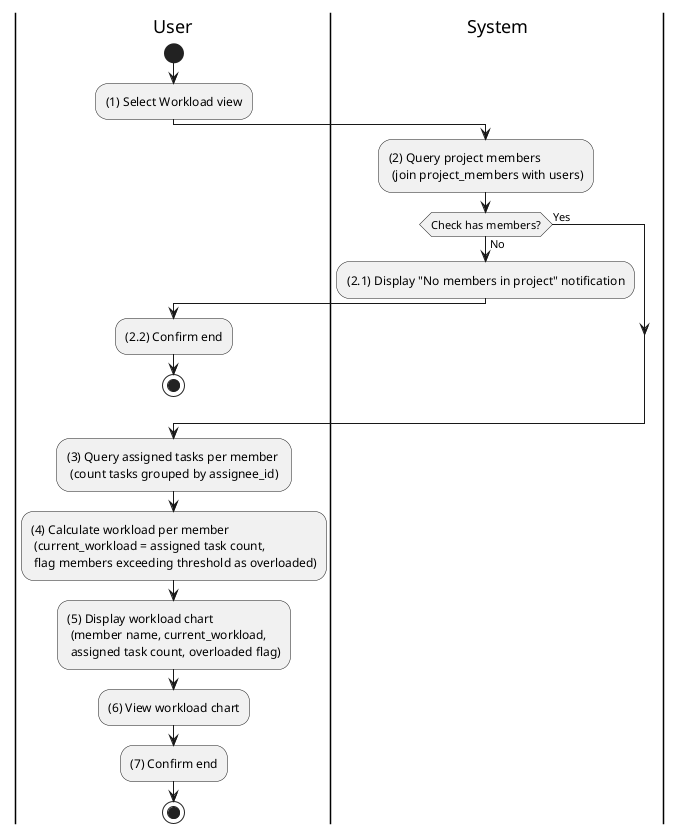

# Activity View Workload

```plantuml
@startuml
|U|User
|S|System

|U|
start
:(1) Select Workload view;

|S|
:(2) Query project members \n (join project_members with users);

if (Check has members?) then (No)
  :(2.1) Display "No members in project" notification;
  |U|
  :(2.2) Confirm end;
  stop
else (Yes)
endif

:(3) Query assigned tasks per member \n (count tasks grouped by assignee_id);

:(4) Calculate workload per member \n (current_workload = assigned task count, \n flag members exceeding threshold as overloaded);

:(5) Display workload chart \n (member name, current_workload, \n assigned task count, overloaded flag);

|U|
:(6) View workload chart;
:(7) Confirm end;

stop
@enduml
```

<!-- diagram id="activity-task-management-view-workload" -->
