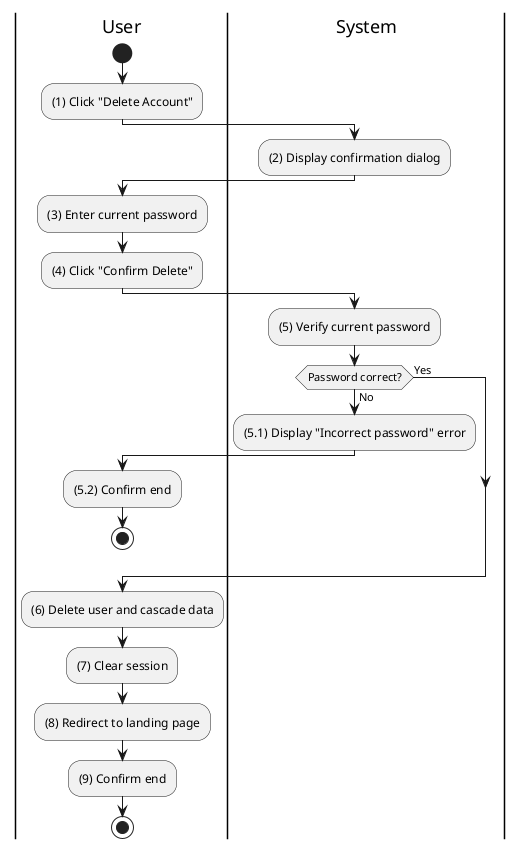

# Activity Delete Personal Account

```plantuml
@startuml
|U|User
|S|System

|U|
start
:(1) Click "Delete Account";

|S|
:(2) Display confirmation dialog;

|U|
:(3) Enter current password;
:(4) Click "Confirm Delete";

|S|
:(5) Verify current password;

if (Password correct?) then (No)
  :(5.1) Display "Incorrect password" error;
  |U|
  :(5.2) Confirm end;
  stop
else (Yes)
endif

:(6) Delete user and cascade data;
:(7) Clear session;
:(8) Redirect to landing page;

|U|
:(9) Confirm end;

stop
@enduml
```

<!-- diagram id="activity-user-profile-delete-personal-account" -->
