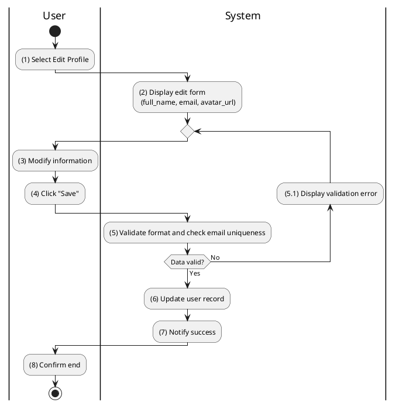

# Activity Update Personal Information

```plantuml
@startuml
|U|User
|S|System

|U|
start
:(1) Select Edit Profile;

|S|
:(2) Display edit form \n (full_name, email, avatar_url);

repeat
  |U|
  :(3) Modify information;
  :(4) Click "Save";

  |S|
  :(5) Validate format and check email uniqueness;
  backward: (5.1) Display validation error;
repeat while (Data valid?) is (No) not (Yes)

:(6) Update user record;
:(7) Notify success;

|U|
:(8) Confirm end;

stop
@enduml
```

<!-- diagram id="activity-user-profile-update-personal-information" -->
