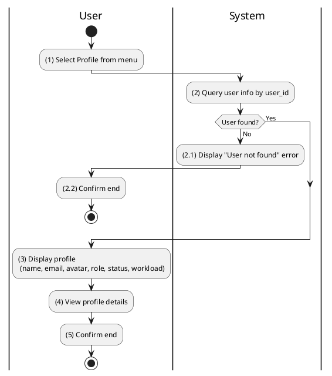

# Activity View User Profile

```plantuml
@startuml
|U|User
|S|System

|U|
start
:(1) Select Profile from menu;

|S|
:(2) Query user info by user_id;

if (User found?) then (No)
  :(2.1) Display "User not found" error;
  |U|
  :(2.2) Confirm end;
  stop
else (Yes)
endif

:(3) Display profile \n (name, email, avatar, role, status, workload);

|U|
:(4) View profile details;
:(5) Confirm end;

stop
@enduml
```

<!-- diagram id="activity-user-profile-view-user-profile" -->
