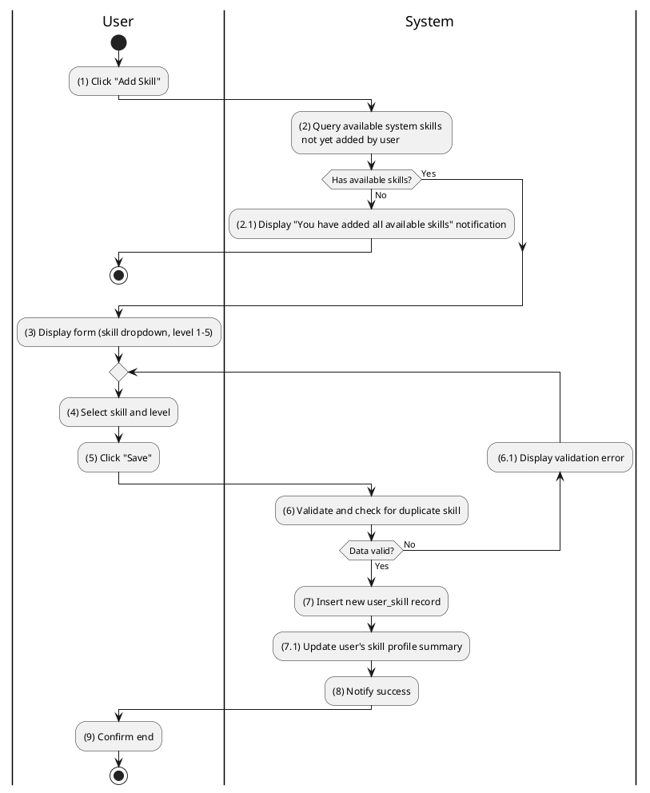

# Activity Add Personal Skill

```plantuml
@startuml
|U|User
|S|System

|U|
start
:(1) Click "Add Skill";

|S|
:(2) Query available system skills \n not yet added by user;

if (Has available skills?) then (No)
  :(2.1) Display "You have added all available skills" notification;
  |U|
  stop
else (Yes)
endif

:(3) Display form (skill dropdown, level 1-5);

repeat
  |U|
  :(4) Select skill and level;
  :(5) Click "Save";

  |S|
  :(6) Validate and check for duplicate skill;
  backward: (6.1) Display validation error;
repeat while (Data valid?) is (No) not (Yes)

:(7) Insert new user_skill record;
:(7.1) Update user's skill profile summary;
:(8) Notify success;

|U|
:(9) Confirm end;

stop
@enduml
```

<!-- diagram id="activity-user-skills-add-personal-skill" -->
