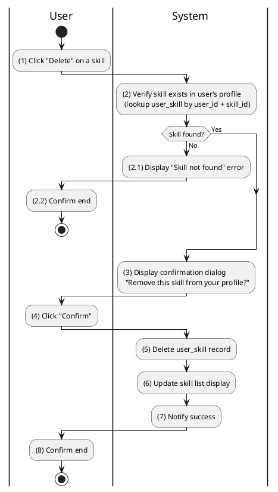

# Activity Delete Personal Skill

```plantuml
@startuml
|U|User
|S|System

|U|
start
:(1) Click "Delete" on a skill;

|S|
:(2) Verify skill exists in user's profile \n (lookup user_skill by user_id + skill_id);

if (Skill found?) then (No)
  :(2.1) Display "Skill not found" error;
  |U|
  :(2.2) Confirm end;
  stop
else (Yes)
endif

|S|
:(3) Display confirmation dialog \n "Remove this skill from your profile?";

|U|
:(4) Click "Confirm";

|S|
:(5) Delete user_skill record;
:(6) Update skill list display;
:(7) Notify success;

|U|
:(8) Confirm end;

stop
@enduml
```

<!-- diagram id="activity-user-skills-delete-personal-skill" -->
