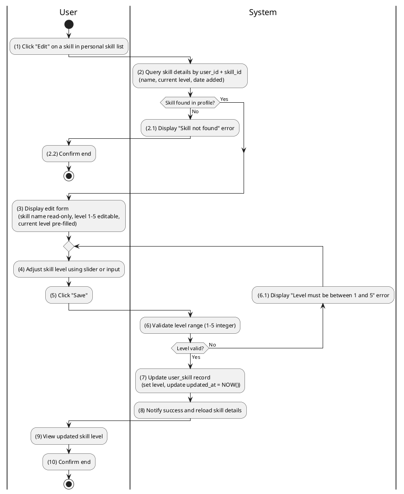

# Activity Update Personal Skill

```plantuml
@startuml
|U|User
|S|System

|U|
start
:(1) Click "Edit" on a skill in personal skill list;

|S|
:(2) Query skill details by user_id + skill_id \n (name, current level, date added);

if (Skill found in profile?) then (No)
  :(2.1) Display "Skill not found" error;
  |U|
  :(2.2) Confirm end;
  stop
else (Yes)
endif

:(3) Display edit form \n (skill name read-only, level 1–5 editable, \n current level pre-filled);

repeat
  |U|
  :(4) Adjust skill level using slider or input;
  :(5) Click "Save";

  |S|
  :(6) Validate level range (1–5 integer);
  backward: (6.1) Display "Level must be between 1 and 5" error;
repeat while (Level valid?) is (No) not (Yes)

:(7) Update user_skill record \n (set level, update updated_at = NOW());
:(8) Notify success and reload skill details;

|U|
:(9) View updated skill level;
:(10) Confirm end;

stop
@enduml
```

<!-- diagram id="activity-user-skills-update-personal-skill" -->
