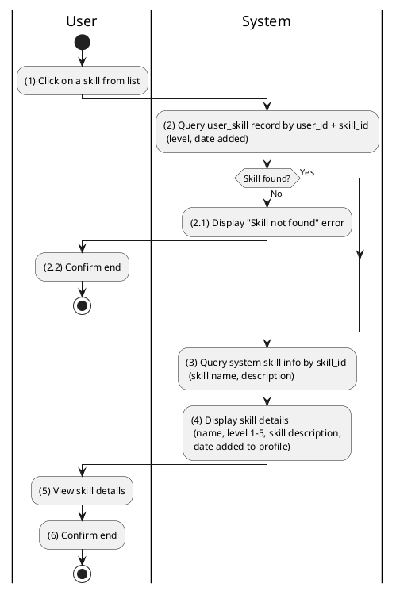

# Activity View Personal Skill Details

```plantuml
@startuml
|U|User
|S|System

|U|
start
:(1) Click on a skill from list;

|S|
:(2) Query user_skill record by user_id + skill_id \n (level, date added);

if (Skill found?) then (No)
  :(2.1) Display "Skill not found" error;
  |U|
  :(2.2) Confirm end;
  stop
else (Yes)
endif

|S|
:(3) Query system skill info by skill_id \n (skill name, description);
:(4) Display skill details \n (name, level 1-5, skill description, \n date added to profile);

|U|
:(5) View skill details;
:(6) Confirm end;

stop
@enduml
```

<!-- diagram id="activity-user-skills-view-personal-skill-details" -->
