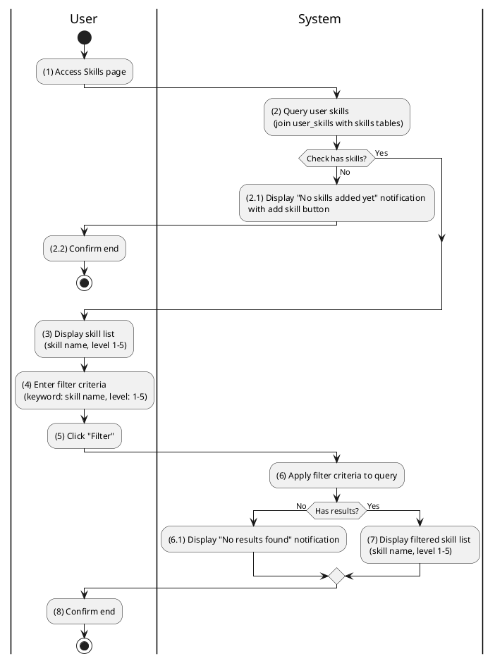

# Activity View Personal Skill List

```plantuml
@startuml
|U|User
|S|System

|U|
start
:(1) Access Skills page;

|S|
:(2) Query user skills \n (join user_skills with skills tables);

if (Check has skills?) then (No)
  :(2.1) Display "No skills added yet" notification \n with add skill button;
  |U|
  :(2.2) Confirm end;
  stop
else (Yes)
endif

:(3) Display skill list \n (skill name, level 1-5);

|U|
:(4) Enter filter criteria \n (keyword: skill name, level: 1-5);
:(5) Click "Filter";

|S|
:(6) Apply filter criteria to query;

if (Has results?) then (No)
  :(6.1) Display "No results found" notification;
  |U|
else (Yes)
  |S|
  :(7) Display filtered skill list \n (skill name, level 1-5);
  |U|
endif

:(8) Confirm end;

stop
@enduml
```

<!-- diagram id="activity-user-skills-view-personal-skill-list" -->
