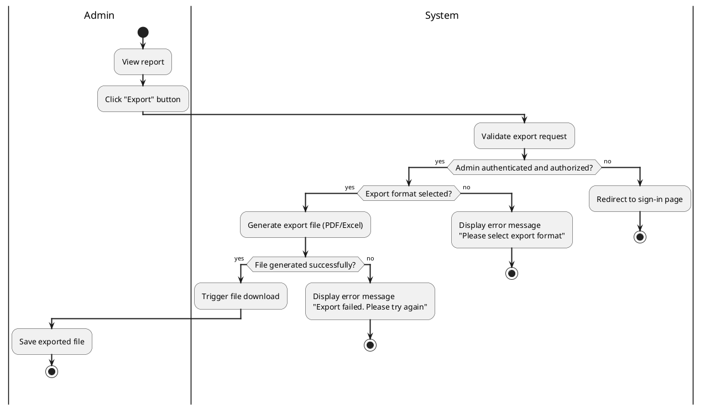

# Activity Export Report

```plantuml
@startuml
skinparam ActivityFontSize 14
skinparam ArrowThickness 2
skinparam Padding 4
skinparam ParticipantPadding 20
skinparam BoxPadding 20

|Admin|
start
:View report;

:Click "Export" button;

|System|
:Validate export request;

if (Admin authenticated and authorized?) then (yes)
  if (Export format selected?) then (yes)
    :Generate export file (PDF/Excel);

    if (File generated successfully?) then (yes)
      |System|
      :Trigger file download;

      |Admin|
      :Save exported file;
      stop
    else (no)
      |System|
      :Display error message\n"Export failed. Please try again";
      stop
    endif
  else (no)
    |System|
    :Display error message\n"Please select export format";
    stop
  endif
else (no)
  |System|
  :Redirect to sign-in page;
  stop
endif

@enduml
```

<!-- diagram id="activity-view-reports-export-report" -->
