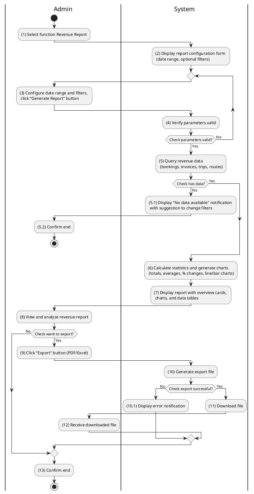

# Activity Revenue Report

```plantuml
@startuml
|A|Admin
|S|System

|A|
start

:(1) Select function Revenue Report;

|S|
:(2) Display report configuration form \n (date range, optional filters);

repeat
  |A|
  :(3) Configure date range and filters, \n click "Generate Report" button;

  |S|
  :(4) Verify parameters valid;
repeat while (Check parameters valid?) is (No) not (Yes)

|S|
:(5) Query revenue data \n (bookings, invoices, trips, routes);

if (Check has data?) then (No)
  :(5.1) Display "No data available" notification \n with suggestion to change filters;
  |A|
  :(5.2) Confirm end;
  stop
else (Yes)
endif

|S|
:(6) Calculate statistics and generate charts \n (totals, averages, % changes, line/bar charts);
:(7) Display report with overview cards, \n charts, and data tables;

|A|
:(8) View and analyze revenue report;

if (Check want to export?) then (Yes)
  :(9) Click "Export" button (PDF/Excel);

  |S|
  :(10) Generate export file;

  if (Check export successful?) then (No)
    :(10.1) Display error notification;
    |A|
  else (Yes)
    |S|
    :(11) Download file;
    |A|
    :(12) Receive downloaded file;
  endif
  |A|
else (No)
endif

:(13) Confirm end;

stop

@enduml
```

<!-- diagram id="activity-view-reports-revenue-report" -->
