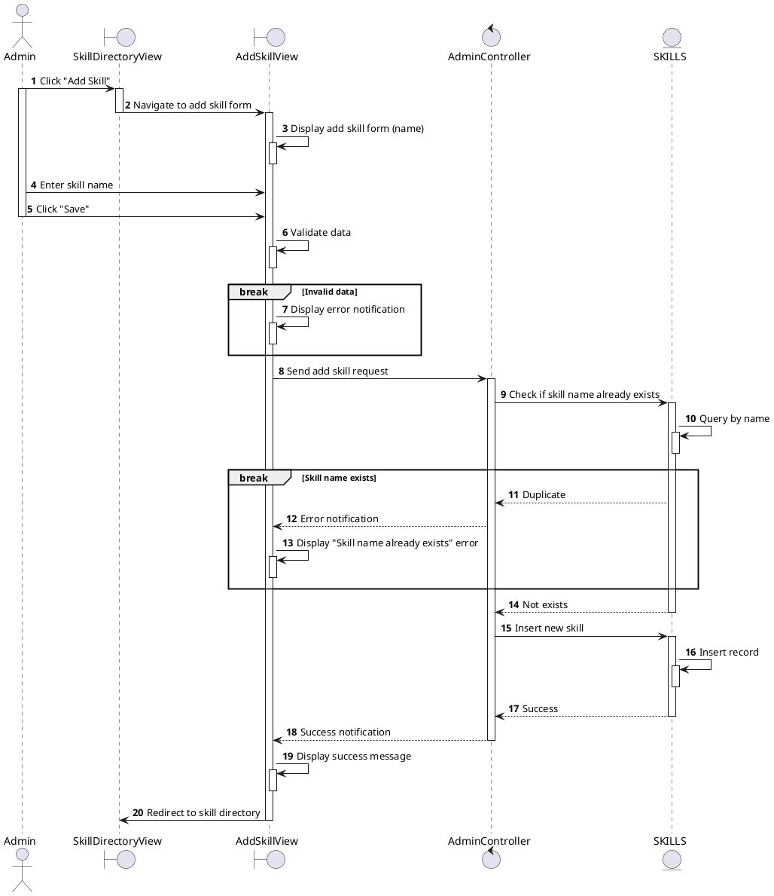

# Sequence Add System Skill

```plantuml
@startuml
autonumber

actor Admin as A
boundary SkillDirectoryView as SDV
boundary AddSkillView as ASV
control AdminController as AC
entity SKILLS as SK

A -> SDV: Click "Add Skill"
activate A
activate SDV
SDV -> ASV: Navigate to add skill form
deactivate SDV
activate ASV
ASV -> ASV: Display add skill form (name)
activate ASV
deactivate ASV

A -> ASV: Enter skill name
A -> ASV: Click "Save"
deactivate A
ASV -> ASV: Validate data
activate ASV
deactivate ASV

break Invalid data
  ASV -> ASV: Display error notification
  activate ASV
  deactivate ASV
end

ASV -> AC: Send add skill request
activate AC
AC -> SK: Check if skill name already exists
activate SK
SK -> SK: Query by name
activate SK
deactivate SK

break Skill name exists
  AC <-- SK: Duplicate
  ASV <-- AC: Error notification
  ASV -> ASV: Display "Skill name already exists" error
  activate ASV
  deactivate ASV
end

AC <-- SK: Not exists
deactivate SK

AC -> SK: Insert new skill
activate SK
SK -> SK: Insert record
activate SK
deactivate SK
AC <-- SK: Success
deactivate SK

ASV <-- AC: Success notification
deactivate AC
ASV -> ASV: Display success message
activate ASV
deactivate ASV
ASV -> SDV: Redirect to skill directory
deactivate ASV

@enduml
```

<!-- diagram id="sequence-admin-add-system-skill" -->
