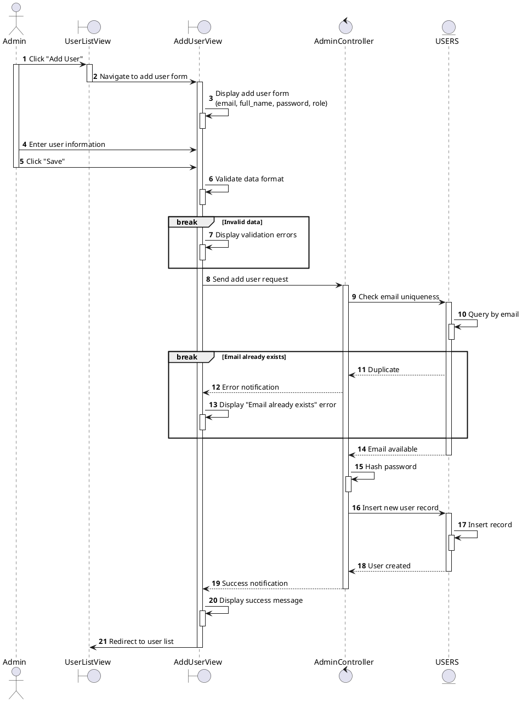

# Sequence Add System User

```plantuml
@startuml
autonumber

actor Admin as A
boundary UserListView as ULV
boundary AddUserView as AUV
control AdminController as AC
entity USERS as US

A -> ULV: Click "Add User"
activate A
activate ULV
ULV -> AUV: Navigate to add user form
deactivate ULV
activate AUV
AUV -> AUV: Display add user form\n(email, full_name, password, role)
activate AUV
deactivate AUV

A -> AUV: Enter user information
A -> AUV: Click "Save"
deactivate A
AUV -> AUV: Validate data format
activate AUV
deactivate AUV

break Invalid data
  AUV -> AUV: Display validation errors
  activate AUV
  deactivate AUV
end

AUV -> AC: Send add user request
activate AC
AC -> US: Check email uniqueness
activate US
US -> US: Query by email
activate US
deactivate US

break Email already exists
  AC <-- US: Duplicate
  AUV <-- AC: Error notification
  AUV -> AUV: Display "Email already exists" error
  activate AUV
  deactivate AUV
end

AC <-- US: Email available
deactivate US

AC -> AC: Hash password
activate AC
deactivate AC

AC -> US: Insert new user record
activate US
US -> US: Insert record
activate US
deactivate US
AC <-- US: User created
deactivate US

AUV <-- AC: Success notification
deactivate AC
AUV -> AUV: Display success message
activate AUV
deactivate AUV
AUV -> ULV: Redirect to user list
deactivate AUV

@enduml
```

<!-- diagram id="sequence-admin-add-system-user" -->
