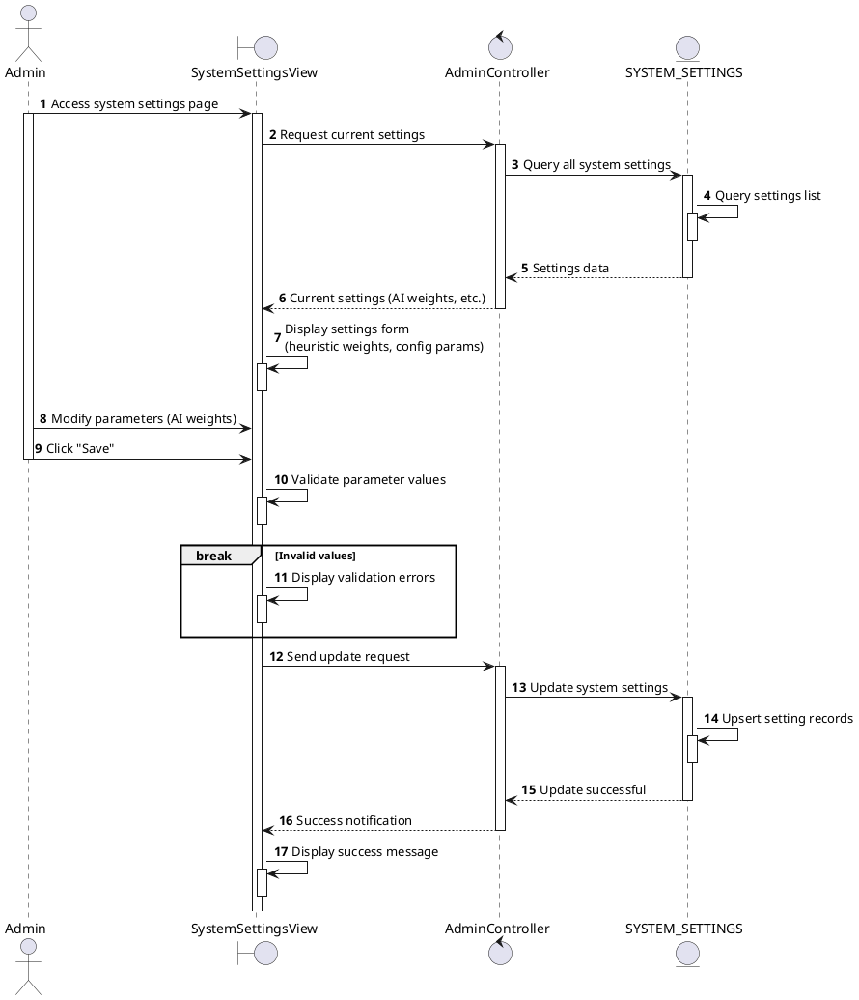

# Sequence Configure System Parameters

```plantuml
@startuml
autonumber

actor Admin as A
boundary SystemSettingsView as SSV
control AdminController as AC
entity SYSTEM_SETTINGS as SS

A -> SSV: Access system settings page
activate A
activate SSV

SSV -> AC: Request current settings
activate AC

AC -> SS: Query all system settings
activate SS
SS -> SS: Query settings list
activate SS
deactivate SS
AC <-- SS: Settings data
deactivate SS

SSV <-- AC: Current settings (AI weights, etc.)
deactivate AC

SSV -> SSV: Display settings form\n(heuristic weights, config params)
activate SSV
deactivate SSV

A -> SSV: Modify parameters (AI weights)
A -> SSV: Click "Save"
deactivate A

SSV -> SSV: Validate parameter values
activate SSV
deactivate SSV

break Invalid values
  SSV -> SSV: Display validation errors
  activate SSV
  deactivate SSV
end

SSV -> AC: Send update request
activate AC

AC -> SS: Update system settings
activate SS
SS -> SS: Upsert setting records
activate SS
deactivate SS
AC <-- SS: Update successful
deactivate SS

SSV <-- AC: Success notification
deactivate AC

SSV -> SSV: Display success message
activate SSV
deactivate SSV

@enduml
```

<!-- diagram id="sequence-admin-configure-system-parameters" -->
