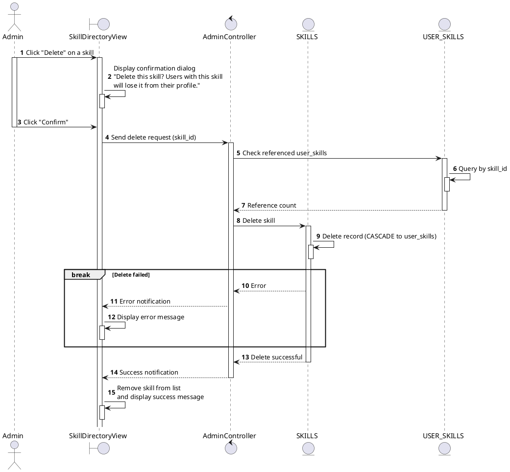

# Sequence Delete System Skill

```plantuml
@startuml
autonumber

actor Admin as A
boundary SkillDirectoryView as SDV
control AdminController as AC
entity SKILLS as SK
entity USER_SKILLS as USK

A -> SDV: Click "Delete" on a skill
activate A
activate SDV
SDV -> SDV: Display confirmation dialog\n"Delete this skill? Users with this skill\nwill lose it from their profile."
activate SDV
deactivate SDV

A -> SDV: Click "Confirm"
deactivate A

SDV -> AC: Send delete request (skill_id)
activate AC
AC -> USK: Check referenced user_skills
activate USK
USK -> USK: Query by skill_id
activate USK
deactivate USK
AC <-- USK: Reference count
deactivate USK

AC -> SK: Delete skill
activate SK
SK -> SK: Delete record (CASCADE to user_skills)
activate SK
deactivate SK

break Delete failed
  AC <-- SK: Error
  SDV <-- AC: Error notification
  SDV -> SDV: Display error message
  activate SDV
  deactivate SDV
end

AC <-- SK: Delete successful
deactivate SK

SDV <-- AC: Success notification
deactivate AC
SDV -> SDV: Remove skill from list\nand display success message
activate SDV
deactivate SDV

@enduml
```

<!-- diagram id="sequence-admin-delete-system-skill" -->
