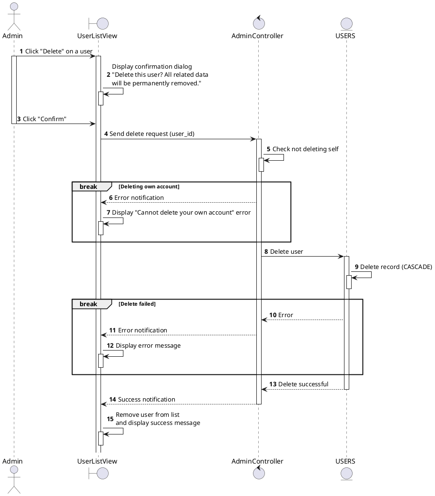

# Sequence Delete System User

```plantuml
@startuml
autonumber

actor Admin as A
boundary UserListView as ULV
control AdminController as AC
entity USERS as US

A -> ULV: Click "Delete" on a user
activate A
activate ULV
ULV -> ULV: Display confirmation dialog\n"Delete this user? All related data\nwill be permanently removed."
activate ULV
deactivate ULV

A -> ULV: Click "Confirm"
deactivate A

ULV -> AC: Send delete request (user_id)
activate AC

AC -> AC: Check not deleting self
activate AC
deactivate AC

break Deleting own account
  ULV <-- AC: Error notification
  ULV -> ULV: Display "Cannot delete your own account" error
  activate ULV
  deactivate ULV
end

AC -> US: Delete user
activate US
US -> US: Delete record (CASCADE)
activate US
deactivate US

break Delete failed
  AC <-- US: Error
  ULV <-- AC: Error notification
  ULV -> ULV: Display error message
  activate ULV
  deactivate ULV
end

AC <-- US: Delete successful
deactivate US

ULV <-- AC: Success notification
deactivate AC
ULV -> ULV: Remove user from list\nand display success message
activate ULV
deactivate ULV

@enduml
```

<!-- diagram id="sequence-admin-delete-system-user" -->
