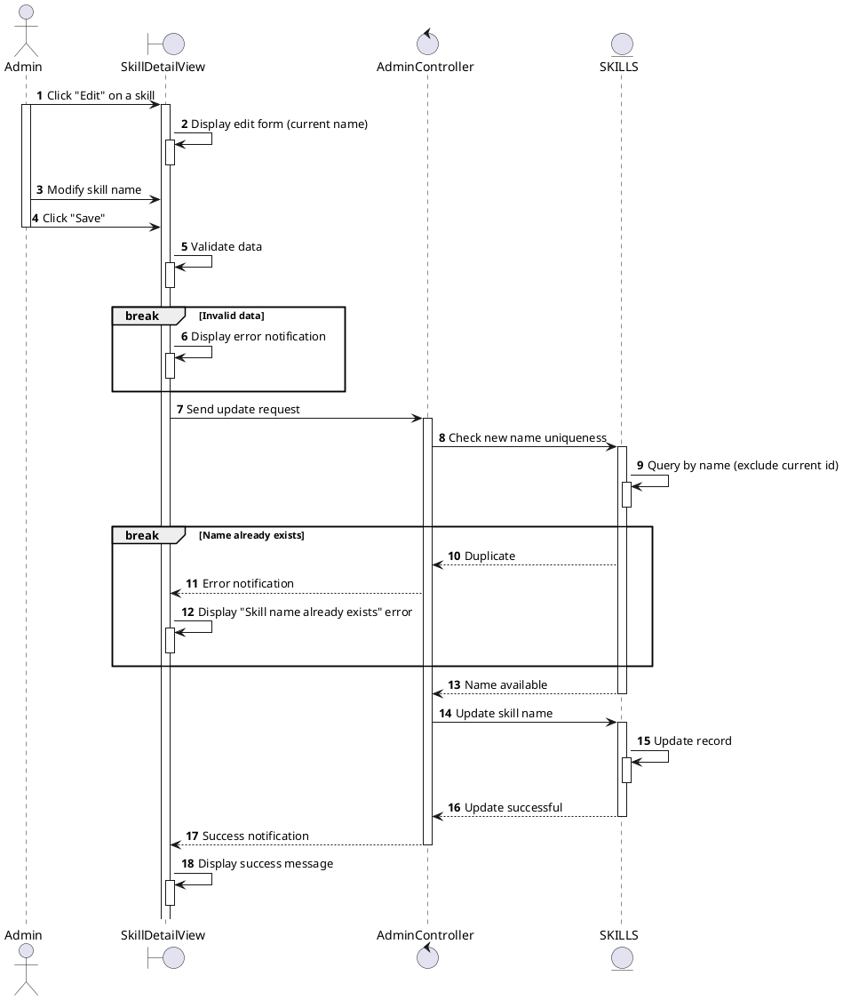

# Sequence Edit System Skill

```plantuml
@startuml
autonumber

actor Admin as A
boundary SkillDetailView as SDV
control AdminController as AC
entity SKILLS as SK

A -> SDV: Click "Edit" on a skill
activate A
activate SDV
SDV -> SDV: Display edit form (current name)
activate SDV
deactivate SDV

A -> SDV: Modify skill name
A -> SDV: Click "Save"
deactivate A
SDV -> SDV: Validate data
activate SDV
deactivate SDV

break Invalid data
  SDV -> SDV: Display error notification
  activate SDV
  deactivate SDV
end

SDV -> AC: Send update request
activate AC
AC -> SK: Check new name uniqueness
activate SK
SK -> SK: Query by name (exclude current id)
activate SK
deactivate SK

break Name already exists
  AC <-- SK: Duplicate
  SDV <-- AC: Error notification
  SDV -> SDV: Display "Skill name already exists" error
  activate SDV
  deactivate SDV
end

AC <-- SK: Name available
deactivate SK

AC -> SK: Update skill name
activate SK
SK -> SK: Update record
activate SK
deactivate SK
AC <-- SK: Update successful
deactivate SK

SDV <-- AC: Success notification
deactivate AC
SDV -> SDV: Display success message
activate SDV
deactivate SDV

@enduml
```

<!-- diagram id="sequence-admin-edit-system-skill" -->
