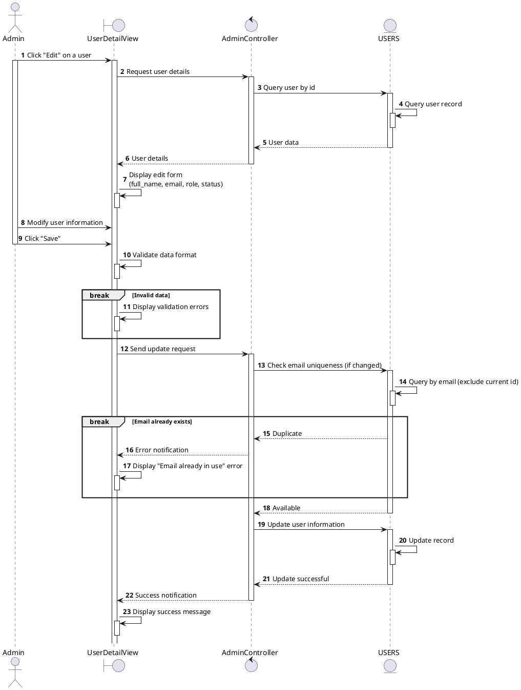

# Sequence Edit System User

```plantuml
@startuml
autonumber

actor Admin as A
boundary UserDetailView as UDV
control AdminController as AC
entity USERS as US

A -> UDV: Click "Edit" on a user
activate A
activate UDV
UDV -> AC: Request user details
activate AC
AC -> US: Query user by id
activate US
US -> US: Query user record
activate US
deactivate US
AC <-- US: User data
deactivate US
UDV <-- AC: User details
deactivate AC
UDV -> UDV: Display edit form\n(full_name, email, role, status)
activate UDV
deactivate UDV

A -> UDV: Modify user information
A -> UDV: Click "Save"
deactivate A
UDV -> UDV: Validate data format
activate UDV
deactivate UDV

break Invalid data
  UDV -> UDV: Display validation errors
  activate UDV
  deactivate UDV
end

UDV -> AC: Send update request
activate AC
AC -> US: Check email uniqueness (if changed)
activate US
US -> US: Query by email (exclude current id)
activate US
deactivate US

break Email already exists
  AC <-- US: Duplicate
  UDV <-- AC: Error notification
  UDV -> UDV: Display "Email already in use" error
  activate UDV
  deactivate UDV
end

AC <-- US: Available
deactivate US

AC -> US: Update user information
activate US
US -> US: Update record
activate US
deactivate US
AC <-- US: Update successful
deactivate US

UDV <-- AC: Success notification
deactivate AC
UDV -> UDV: Display success message
activate UDV
deactivate UDV

@enduml
```

<!-- diagram id="sequence-admin-edit-system-user" -->
