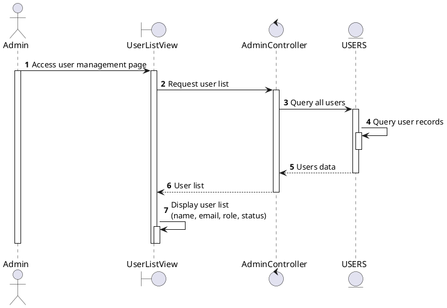

# Sequence View Global User List

```plantuml
@startuml
autonumber

actor Admin as A
boundary UserListView as ULV
control AdminController as AC
entity USERS as US

A -> ULV: Access user management page
activate A
activate ULV
ULV -> AC: Request user list
activate AC
AC -> US: Query all users
activate US
US -> US: Query user records
activate US
deactivate US
AC <-- US: Users data
deactivate US
ULV <-- AC: User list
deactivate AC
ULV -> ULV: Display user list\n(name, email, role, status)
activate ULV
deactivate ULV
deactivate ULV
deactivate A

@enduml
```

<!-- diagram id="sequence-admin-view-global-user-list" -->
