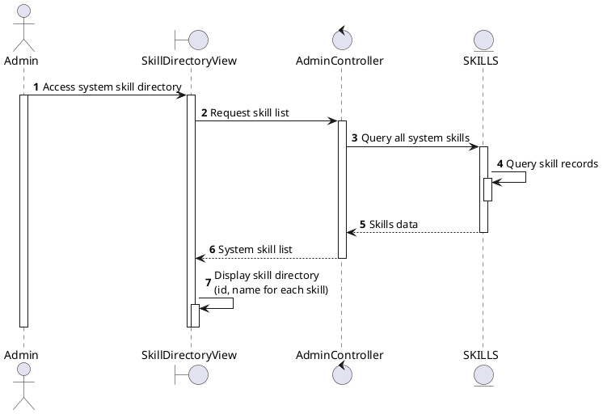

# Sequence View System Skill Directory

```plantuml
@startuml
autonumber

actor Admin as A
boundary SkillDirectoryView as SDV
control AdminController as AC
entity SKILLS as SK

A -> SDV: Access system skill directory
activate A
activate SDV
SDV -> AC: Request skill list
activate AC
AC -> SK: Query all system skills
activate SK
SK -> SK: Query skill records
activate SK
deactivate SK
AC <-- SK: Skills data
deactivate SK
SDV <-- AC: System skill list
deactivate AC
SDV -> SDV: Display skill directory\n(id, name for each skill)
activate SDV
deactivate SDV
deactivate SDV
deactivate A

@enduml
```

<!-- diagram id="sequence-admin-view-system-skill-directory" -->
