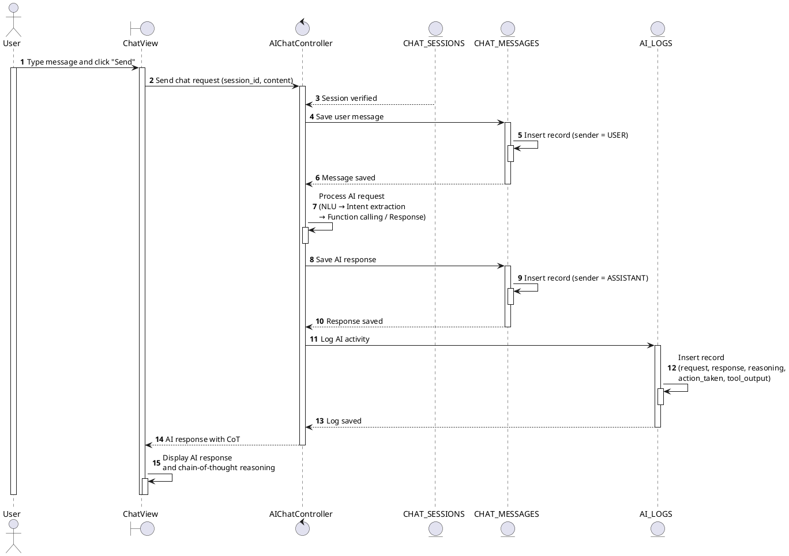

# Sequence Chat with AI

```plantuml
@startuml
autonumber

actor User as U
boundary ChatView as CV
control AIChatController as ACC
entity CHAT_SESSIONS as CS
entity CHAT_MESSAGES as CM
entity AI_LOGS as AL

U -> CV: Type message and click "Send"
activate U
activate CV

CV -> ACC: Send chat request (session_id, content)
activate ACC

ACC <-- CS: Session verified
deactivate CS

ACC -> CM: Save user message
activate CM
CM -> CM: Insert record (sender = USER)
activate CM
deactivate CM
ACC <-- CM: Message saved
deactivate CM

ACC -> ACC: Process AI request\n(NLU → Intent extraction\n→ Function calling / Response)
activate ACC
deactivate ACC

ACC -> CM: Save AI response
activate CM
CM -> CM: Insert record (sender = ASSISTANT)
activate CM
deactivate CM
ACC <-- CM: Response saved
deactivate CM

ACC -> AL: Log AI activity
activate AL
AL -> AL: Insert record\n(request, response, reasoning,\naction_taken, tool_output)
activate AL
deactivate AL
ACC <-- AL: Log saved
deactivate AL

CV <-- ACC: AI response with CoT
deactivate ACC

CV -> CV: Display AI response\nand chain-of-thought reasoning
activate CV
deactivate CV

deactivate CV
deactivate U

@enduml
```

<!-- diagram id="sequence-ai-assistant-chat-with-ai" -->
