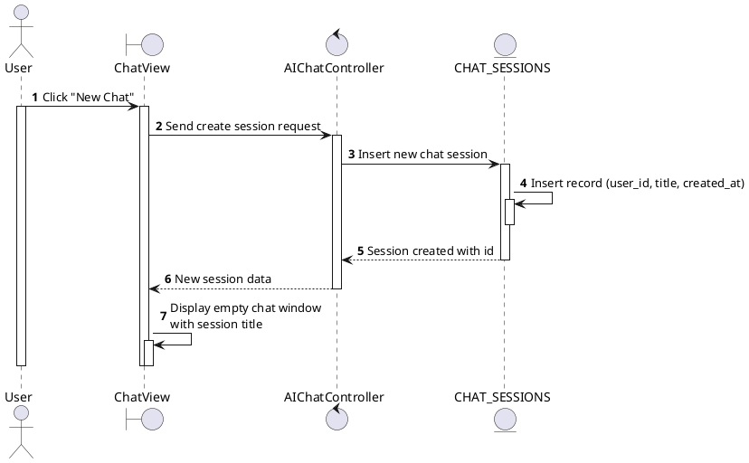

# Sequence Create New AI Chat Session

```plantuml
@startuml
autonumber

actor User as U
boundary ChatView as CV
control AIChatController as ACC
entity CHAT_SESSIONS as CS

U -> CV: Click "New Chat"
activate U
activate CV

CV -> ACC: Send create session request
activate ACC

ACC -> CS: Insert new chat session
activate CS
CS -> CS: Insert record (user_id, title, created_at)
activate CS
deactivate CS
ACC <-- CS: Session created with id
deactivate CS

CV <-- ACC: New session data
deactivate ACC

CV -> CV: Display empty chat window\nwith session title
activate CV
deactivate CV

deactivate CV
deactivate U

@enduml
```

<!-- diagram id="sequence-ai-assistant-create-new-ai-chat-session" -->
