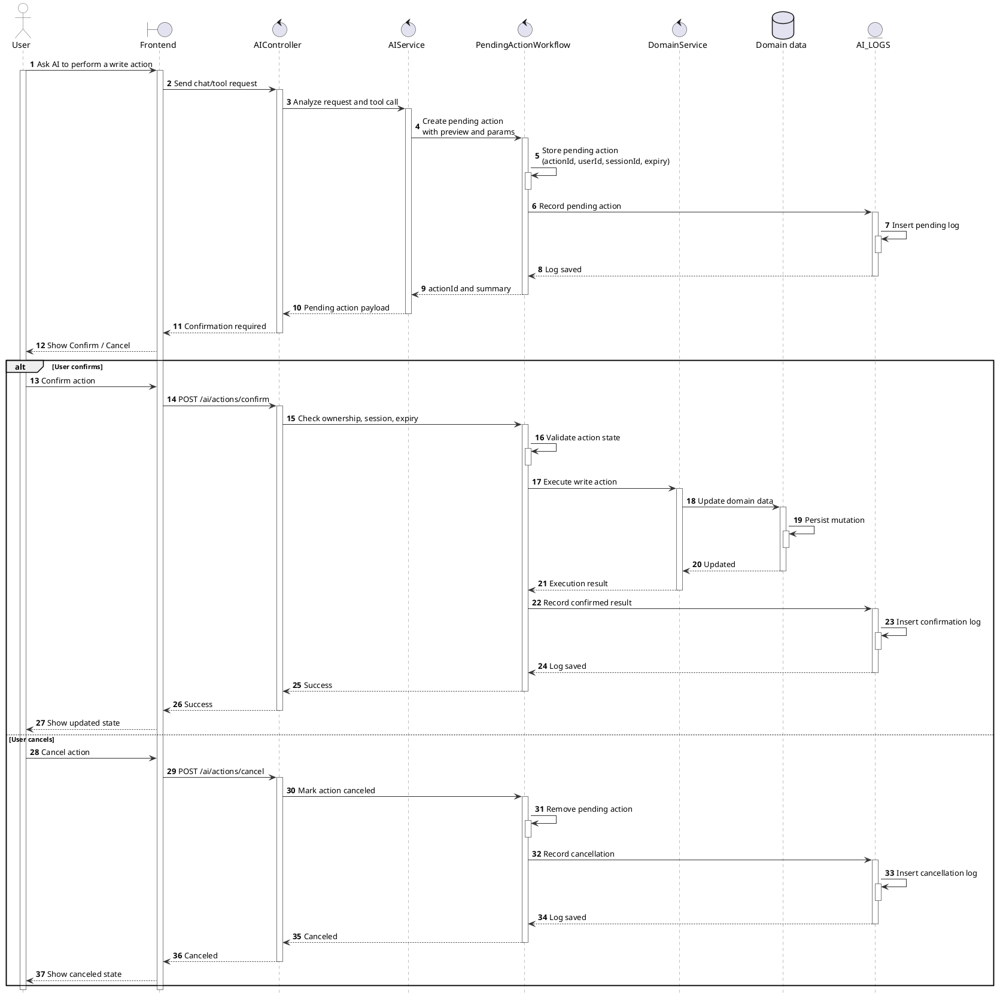

# Sequence Pending Action Confirmation

This diagram documents the human-in-the-loop confirmation flow used when AI Copilot proposes a write action. The source is copied from the existing report diagram source rather than invented for the docs site.

<!-- diagram id="sequence-ai-pending-action-confirmation" -->

Related docs: [SRS pending action confirmation](/docs/srs/#pending-action-confirmation), [AI chat UI](/docs/ui-specification#ai-chat), [Pending action confirmation UI](/docs/ui-specification#pending-action-confirmation).
