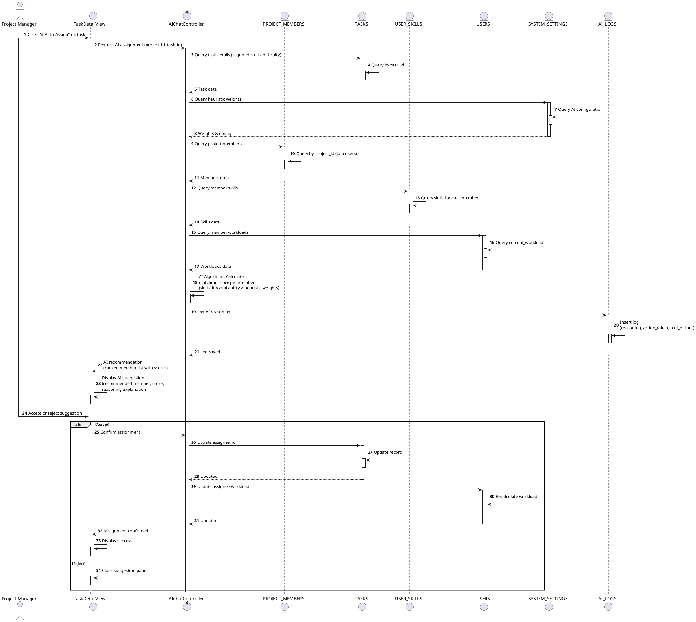

# Sequence Request AI Auto-Assignment

```plantuml
@startuml
autonumber

actor "Project Manager" as PM
boundary TaskDetailView as TDV
control AIChatController as ACC
entity PROJECT_MEMBERS as PME
entity TASKS as T
entity USER_SKILLS as USK
entity USERS as US
entity SYSTEM_SETTINGS as SS
entity AI_LOGS as AL

PM -> TDV: Click "AI Auto-Assign" on task
activate PM
activate TDV

TDV -> ACC: Request AI assignment (project_id, task_id)
activate ACC

ACC -> T: Query task details (required_skills, difficulty)
activate T
T -> T: Query by task_id
activate T
deactivate T
ACC <-- T: Task data
deactivate T

ACC -> SS: Query heuristic weights
activate SS
SS -> SS: Query AI configuration
activate SS
deactivate SS
ACC <-- SS: Weights & config
deactivate SS

ACC -> PME: Query project members
activate PME
PME -> PME: Query by project_id (join users)
activate PME
deactivate PME
ACC <-- PME: Members data
deactivate PME

ACC -> USK: Query member skills
activate USK
USK -> USK: Query skills for each member
activate USK
deactivate USK
ACC <-- USK: Skills data
deactivate USK

ACC -> US: Query member workloads
activate US
US -> US: Query current_workload
activate US
deactivate US
ACC <-- US: Workloads data
deactivate US

ACC -> ACC: AI Algorithm: Calculate\nmatching score per member\n(skills fit × availability × heuristic weights)
activate ACC
deactivate ACC

ACC -> AL: Log AI reasoning
activate AL
AL -> AL: Insert log\n(reasoning, action_taken, tool_output)
activate AL
deactivate AL
ACC <-- AL: Log saved
deactivate AL

TDV <-- ACC: AI recommendation\n(ranked member list with scores)

TDV -> TDV: Display AI suggestion\n(recommended member, score,\nreasoning explanation)
activate TDV
deactivate TDV

PM -> TDV: Accept or reject suggestion
deactivate PM

alt Accept
    TDV -> ACC: Confirm assignment

    ACC -> T: Update assignee_id
    activate T
    T -> T: Update record
    activate T
    deactivate T
    ACC <-- T: Updated
    deactivate T

    ACC -> US: Update assignee workload
    activate US
    US -> US: Recalculate workload
    activate US
    deactivate US
    ACC <-- US: Updated
    deactivate US

    TDV <-- ACC: Assignment confirmed
    TDV -> TDV: Display success
    activate TDV
    deactivate TDV
else Reject
    TDV -> TDV: Close suggestion panel
    activate TDV
    deactivate TDV
end

deactivate ACC
deactivate TDV

@enduml
```

<!-- diagram id="sequence-ai-assistant-request-ai-auto-assignment" -->
