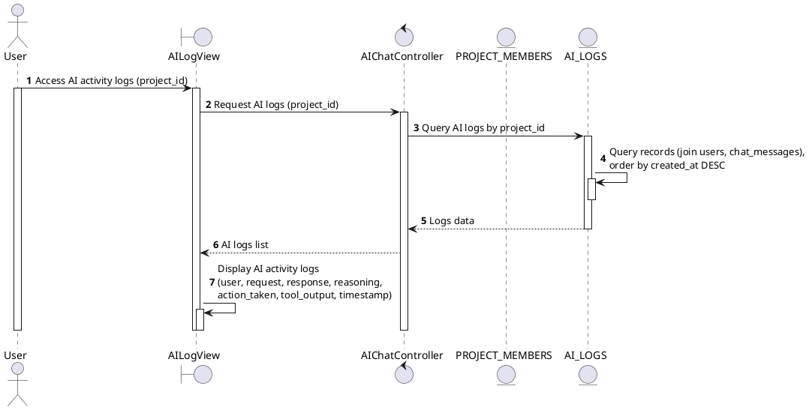

# Sequence View AI Activity Logs

```plantuml
@startuml
autonumber

actor User as U
boundary AILogView as ALV
control AIChatController as ACC
entity PROJECT_MEMBERS as PM
entity AI_LOGS as AL

U -> ALV: Access AI activity logs (project_id)
activate U
activate ALV

ALV -> ACC: Request AI logs (project_id)
activate ACC

ACC -> AL: Query AI logs by project_id
activate AL
AL -> AL: Query records (join users, chat_messages),\norder by created_at DESC
activate AL
deactivate AL
ACC <-- AL: Logs data
deactivate AL

ALV <-- ACC: AI logs list

ALV -> ALV: Display AI activity logs\n(user, request, response, reasoning,\naction_taken, tool_output, timestamp)
activate ALV
deactivate ALV

deactivate ACC
deactivate ALV
deactivate U

@enduml
```

<!-- diagram id="sequence-ai-assistant-view-ai-activity-logs" -->
