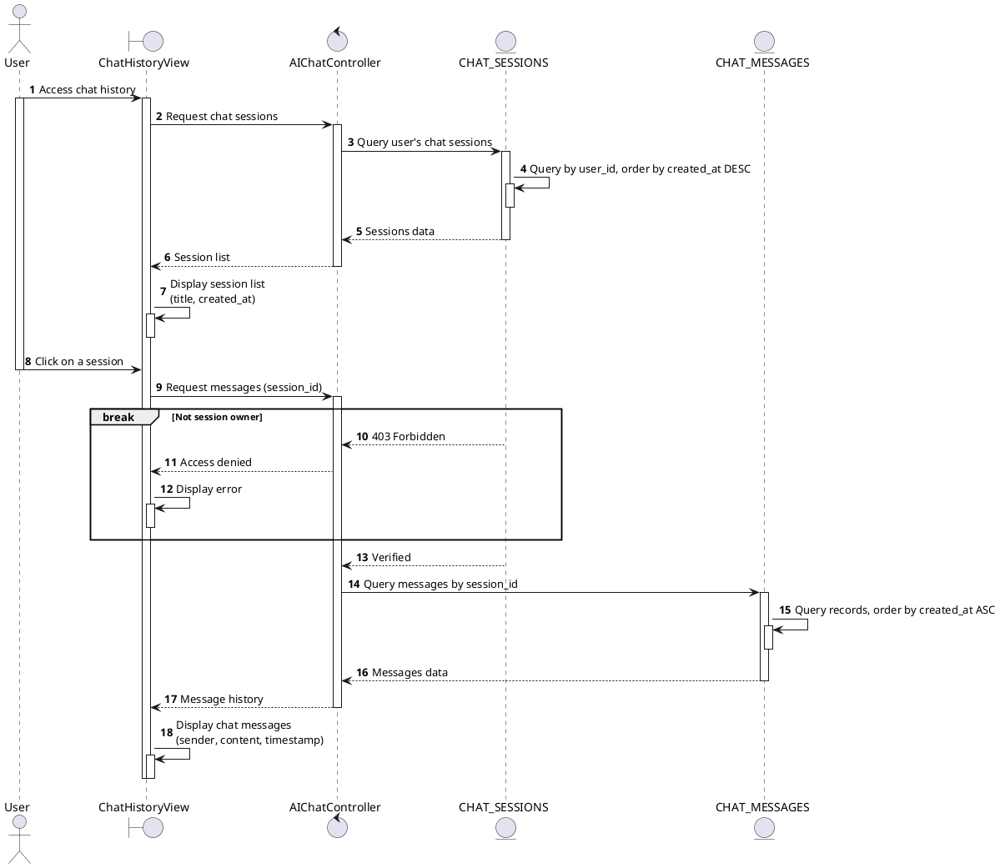

# Sequence View AI Chat History

```plantuml
@startuml
autonumber

actor User as U
boundary ChatHistoryView as CHV
control AIChatController as ACC
entity CHAT_SESSIONS as CS
entity CHAT_MESSAGES as CM

U -> CHV: Access chat history
activate U
activate CHV

CHV -> ACC: Request chat sessions
activate ACC

ACC -> CS: Query user's chat sessions
activate CS
CS -> CS: Query by user_id, order by created_at DESC
activate CS
deactivate CS
ACC <-- CS: Sessions data
deactivate CS

CHV <-- ACC: Session list
deactivate ACC

CHV -> CHV: Display session list\n(title, created_at)
activate CHV
deactivate CHV

U -> CHV: Click on a session
deactivate U

CHV -> ACC: Request messages (session_id)
activate ACC

break Not session owner
    ACC <-- CS: 403 Forbidden
    CHV <-- ACC: Access denied
    CHV -> CHV: Display error
    activate CHV
    deactivate CHV
end

ACC <-- CS: Verified
deactivate CS

ACC -> CM: Query messages by session_id
activate CM
CM -> CM: Query records, order by created_at ASC
activate CM
deactivate CM
ACC <-- CM: Messages data
deactivate CM

CHV <-- ACC: Message history
deactivate ACC

CHV -> CHV: Display chat messages\n(sender, content, timestamp)
activate CHV
deactivate CHV

deactivate CHV

@enduml
```

<!-- diagram id="sequence-ai-assistant-view-ai-chat-history" -->
