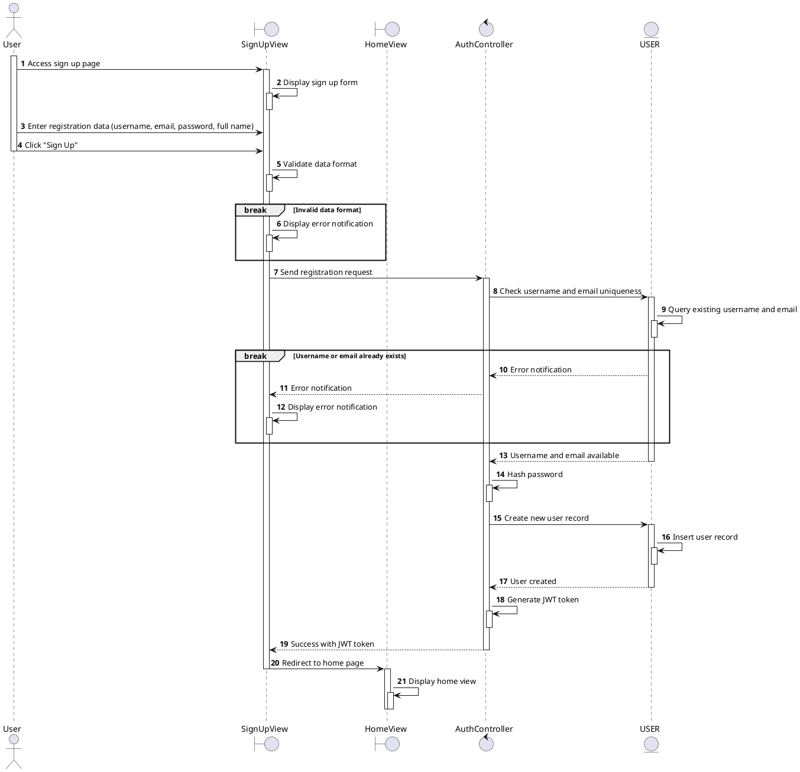

# Sequence Register / Sign Up

```plantuml
@startuml
autonumber

actor User as U
boundary SignUpView as SUV
boundary HomeView as HV
control AuthController as AC
entity USER as US

activate U
U -> SUV: Access sign up page
activate SUV
SUV -> SUV: Display sign up form
activate SUV
deactivate SUV

U -> SUV: Enter registration data (username, email, password, full name)
U -> SUV: Click "Sign Up"
deactivate U
SUV -> SUV: Validate data format
activate SUV
deactivate SUV

break Invalid data format
  SUV -> SUV: Display error notification
  activate SUV
  deactivate SUV
end

SUV -> AC: Send registration request
activate AC
AC -> US: Check username and email uniqueness
activate US
US -> US: Query existing username and email
activate US
deactivate US

break Username or email already exists
  AC <-- US: Error notification
  SUV <-- AC: Error notification
  SUV -> SUV: Display error notification
  activate SUV
  deactivate SUV
end

AC <-- US: Username and email available
deactivate US

AC -> AC: Hash password
activate AC
deactivate AC
AC -> US: Create new user record
activate US
US -> US: Insert user record
activate US
deactivate US
AC <-- US: User created
deactivate US

AC -> AC: Generate JWT token
activate AC
deactivate AC

SUV <-- AC: Success with JWT token
deactivate AC
SUV -> HV: Redirect to home page
deactivate SUV
activate HV
HV -> HV: Display home view
activate HV
deactivate HV
deactivate HV

@enduml
```

<!-- diagram id="sequence-auth-register" -->
