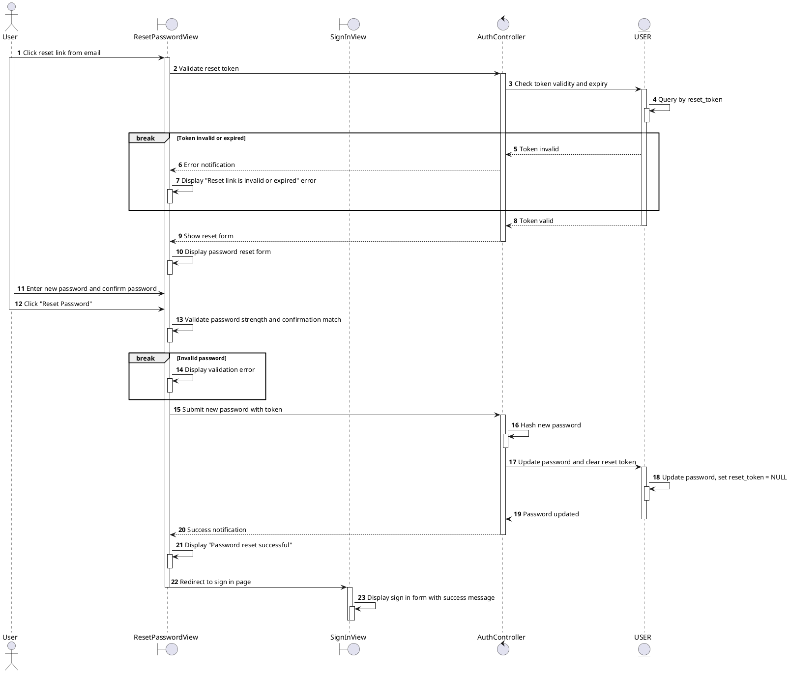

# Sequence Reset Password

```plantuml
@startuml
autonumber

actor User as U
boundary ResetPasswordView as RPV
boundary SignInView as SIV
control AuthController as AC
entity USER as US

U -> RPV: Click reset link from email
activate U
activate RPV
RPV -> AC: Validate reset token
activate AC
AC -> US: Check token validity and expiry
activate US
US -> US: Query by reset_token
activate US
deactivate US

break Token invalid or expired
  AC <-- US: Token invalid
  RPV <-- AC: Error notification
  RPV -> RPV: Display "Reset link is invalid or expired" error
  activate RPV
  deactivate RPV
end

AC <-- US: Token valid
deactivate US

RPV <-- AC: Show reset form
deactivate AC
RPV -> RPV: Display password reset form
activate RPV
deactivate RPV

U -> RPV: Enter new password and confirm password
U -> RPV: Click "Reset Password"
deactivate U
RPV -> RPV: Validate password strength and confirmation match
activate RPV
deactivate RPV

break Invalid password
  RPV -> RPV: Display validation error
  activate RPV
  deactivate RPV
end

RPV -> AC: Submit new password with token
activate AC
AC -> AC: Hash new password
activate AC
deactivate AC
AC -> US: Update password and clear reset token
activate US
US -> US: Update password, set reset_token = NULL
activate US
deactivate US
AC <-- US: Password updated
deactivate US

RPV <-- AC: Success notification
deactivate AC
RPV -> RPV: Display "Password reset successful"
activate RPV
deactivate RPV
RPV -> SIV: Redirect to sign in page
deactivate RPV
activate SIV
SIV -> SIV: Display sign in form with success message
activate SIV
deactivate SIV
deactivate SIV

@enduml
```

<!-- diagram id="sequence-auth-reset-password" -->
