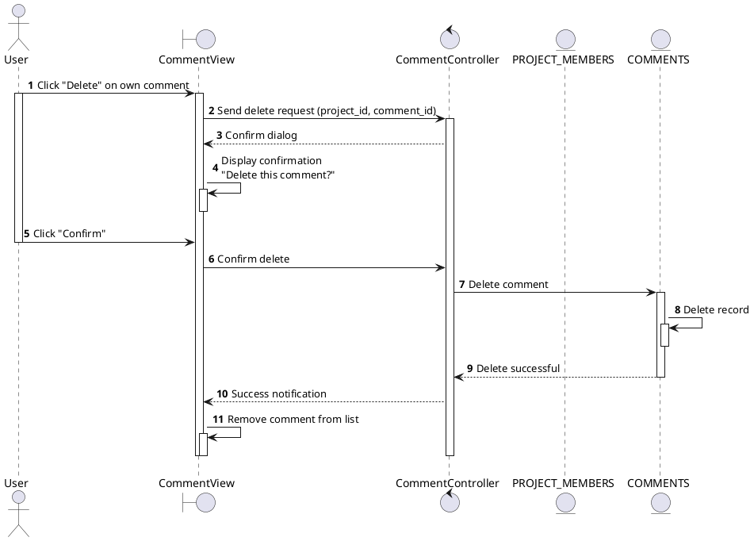

# Sequence Delete Comment

```plantuml
@startuml
autonumber

actor User as U
boundary CommentView as CV
control CommentController as CC
entity PROJECT_MEMBERS as PM
entity COMMENTS as C

U -> CV: Click "Delete" on own comment
activate U
activate CV

CV -> CC: Send delete request (project_id, comment_id)
activate CC

CV <-- CC: Confirm dialog

CV -> CV: Display confirmation\n"Delete this comment?"
activate CV
deactivate CV

U -> CV: Click "Confirm"
deactivate U

CV -> CC: Confirm delete

CC -> C: Delete comment
activate C
C -> C: Delete record
activate C
deactivate C
CC <-- C: Delete successful
deactivate C

CV <-- CC: Success notification

CV -> CV: Remove comment from list
activate CV
deactivate CV

deactivate CC
deactivate CV

@enduml
```

<!-- diagram id="sequence-interaction-communication-delete-comment" -->
