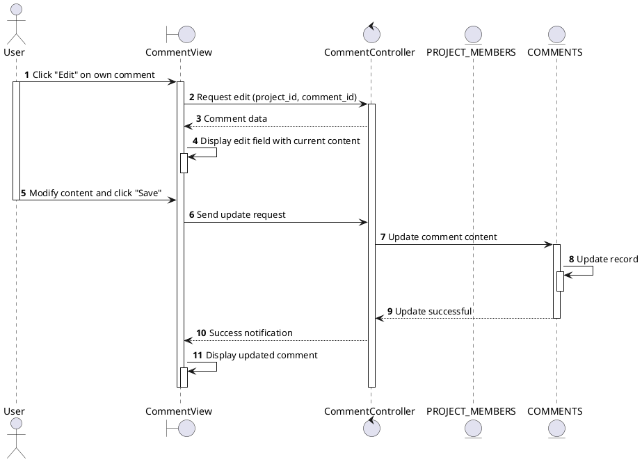

# Sequence Edit Comment

```plantuml
@startuml
autonumber

actor User as U
boundary CommentView as CV
control CommentController as CC
entity PROJECT_MEMBERS as PM
entity COMMENTS as C

U -> CV: Click "Edit" on own comment
activate U
activate CV

CV -> CC: Request edit (project_id, comment_id)
activate CC

CV <-- CC: Comment data

CV -> CV: Display edit field with current content
activate CV
deactivate CV

U -> CV: Modify content and click "Save"
deactivate U

CV -> CC: Send update request

CC -> C: Update comment content
activate C
C -> C: Update record
activate C
deactivate C
CC <-- C: Update successful
deactivate C

CV <-- CC: Success notification

CV -> CV: Display updated comment
activate CV
deactivate CV

deactivate CC
deactivate CV

@enduml
```

<!-- diagram id="sequence-interaction-communication-edit-comment" -->
