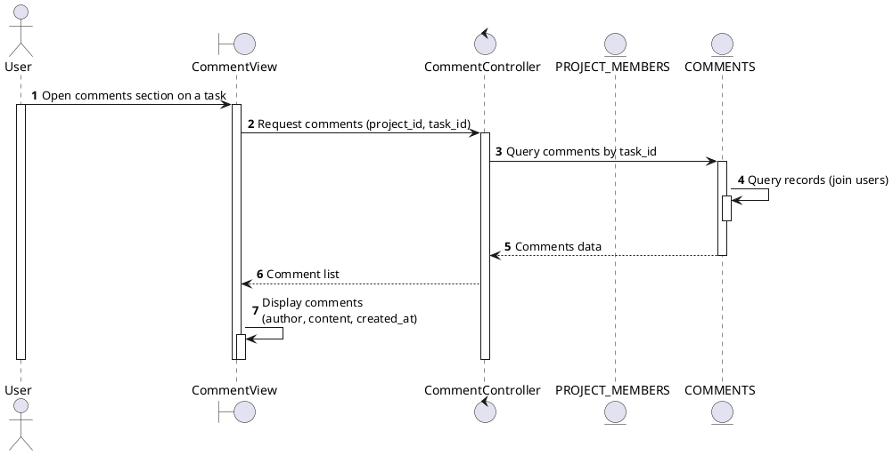

# Sequence View Comments

```plantuml
@startuml
autonumber

actor User as U
boundary CommentView as CV
control CommentController as CC
entity PROJECT_MEMBERS as PM
entity COMMENTS as C

U -> CV: Open comments section on a task
activate U
activate CV

CV -> CC: Request comments (project_id, task_id)
activate CC

CC -> C: Query comments by task_id
activate C
C -> C: Query records (join users)
activate C
deactivate C
CC <-- C: Comments data
deactivate C

CV <-- CC: Comment list

CV -> CV: Display comments\n(author, content, created_at)
activate CV
deactivate CV

deactivate CC
deactivate CV
deactivate U

@enduml
```

<!-- diagram id="sequence-interaction-communication-view-comments" -->
