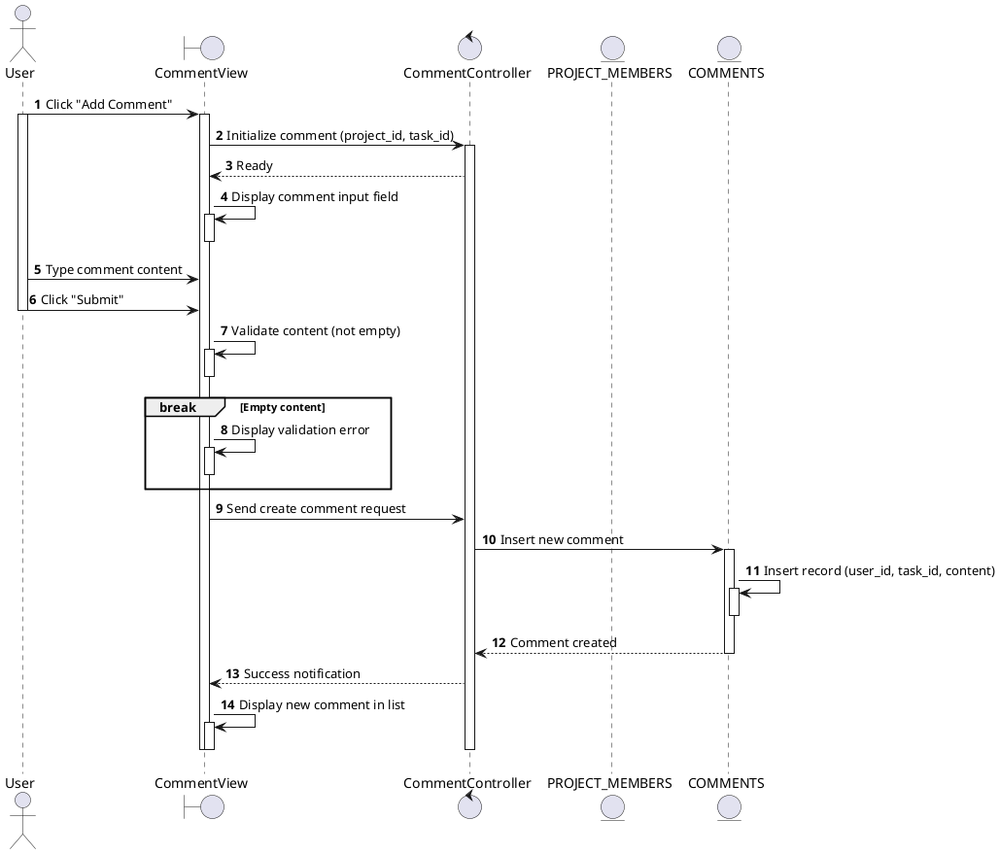

# Sequence Write Comment

```plantuml
@startuml
autonumber

actor User as U
boundary CommentView as CV
control CommentController as CC
entity PROJECT_MEMBERS as PM
entity COMMENTS as C

U -> CV: Click "Add Comment"
activate U
activate CV

CV -> CC: Initialize comment (project_id, task_id)
activate CC

CV <-- CC: Ready

CV -> CV: Display comment input field
activate CV
deactivate CV

U -> CV: Type comment content
U -> CV: Click "Submit"
deactivate U

CV -> CV: Validate content (not empty)
activate CV
deactivate CV

break Empty content
    CV -> CV: Display validation error
    activate CV
    deactivate CV
end

CV -> CC: Send create comment request

CC -> C: Insert new comment
activate C
C -> C: Insert record (user_id, task_id, content)
activate C
deactivate C
CC <-- C: Comment created
deactivate C

CV <-- CC: Success notification

CV -> CV: Display new comment in list
activate CV
deactivate CV

deactivate CC
deactivate CV

@enduml
```

<!-- diagram id="sequence-interaction-communication-write-comment" -->
