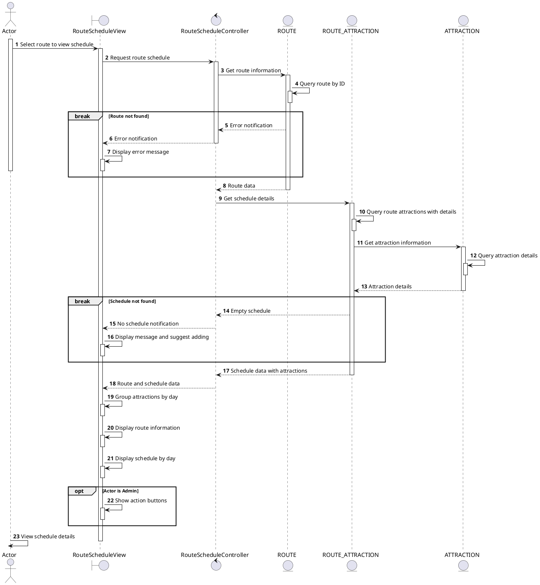

# Sequence View Route Schedule

```plantuml
@startuml
autonumber

actor Actor as A
boundary RouteScheduleView as RSV
control RouteScheduleController as RSC
entity ROUTE as R
entity ROUTE_ATTRACTION as RA
entity ATTRACTION as AT

activate A
A -> RSV: Select route to view schedule
activate RSV
RSV -> RSC: Request route schedule
activate RSC

RSC -> R: Get route information
activate R
R -> R: Query route by ID
activate R
deactivate R

break Route not found
  RSC <-- R: Error notification
  RSV <-- RSC: Error notification
  deactivate RSC
  RSV -> RSV: Display error message
  activate RSV
  deactivate RSV
  deactivate A
end

RSC <-- R: Route data
deactivate R

RSC -> RA: Get schedule details
activate RA
RA -> RA: Query route attractions with details
activate RA
deactivate RA
RA -> AT: Get attraction information
activate AT
AT -> AT: Query attraction details
activate AT
deactivate AT
RA <-- AT: Attraction details
deactivate AT

break Schedule not found
  RSC <-- RA: Empty schedule
  RSV <-- RSC: No schedule notification
  deactivate RSC
  RSV -> RSV: Display message and suggest adding
  activate RSV
  deactivate RSV
  deactivate A
end

RSC <-- RA: Schedule data with attractions
deactivate RA

RSV <-- RSC: Route and schedule data
deactivate RSC

RSV -> RSV: Group attractions by day
activate RSV
deactivate RSV

RSV -> RSV: Display route information
activate RSV
deactivate RSV

RSV -> RSV: Display schedule by day
activate RSV
deactivate RSV

opt Actor is Admin
  RSV -> RSV: Show action buttons
  activate RSV
  deactivate RSV
end

A -> A: View schedule details
deactivate A
deactivate RSV

@enduml
```

<!-- diagram id="sequence-manage-route-schedule-view-route-schedule" -->
