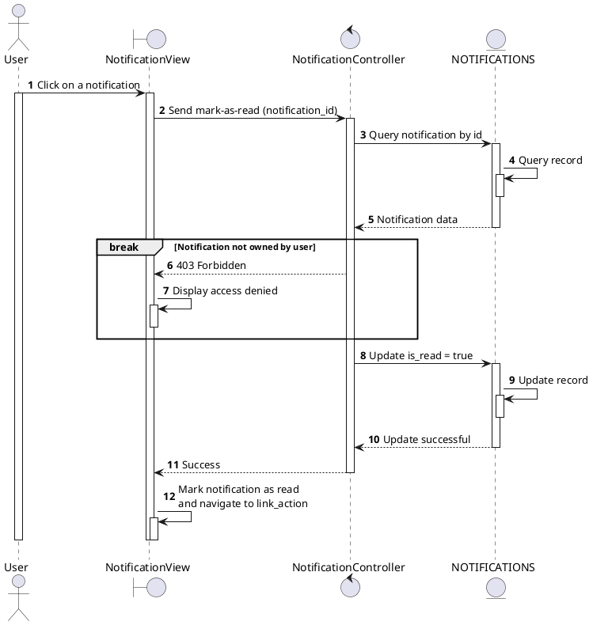

# Sequence Mark Notification as Read

```plantuml
@startuml
autonumber

actor User as U
boundary NotificationView as NV
control NotificationController as NC
entity NOTIFICATIONS as N

U -> NV: Click on a notification
activate U
activate NV

NV -> NC: Send mark-as-read (notification_id)
activate NC

NC -> N: Query notification by id
activate N
N -> N: Query record
activate N
deactivate N
NC <-- N: Notification data
deactivate N

break Notification not owned by user
    NV <-- NC: 403 Forbidden
    NV -> NV: Display access denied
    activate NV
    deactivate NV
end

NC -> N: Update is_read = true
activate N
N -> N: Update record
activate N
deactivate N
NC <-- N: Update successful
deactivate N

NV <-- NC: Success
deactivate NC

NV -> NV: Mark notification as read\nand navigate to link_action
activate NV
deactivate NV

deactivate NV
deactivate U

@enduml
```

<!-- diagram id="sequence-notification-management-mark-notification-as-read" -->
