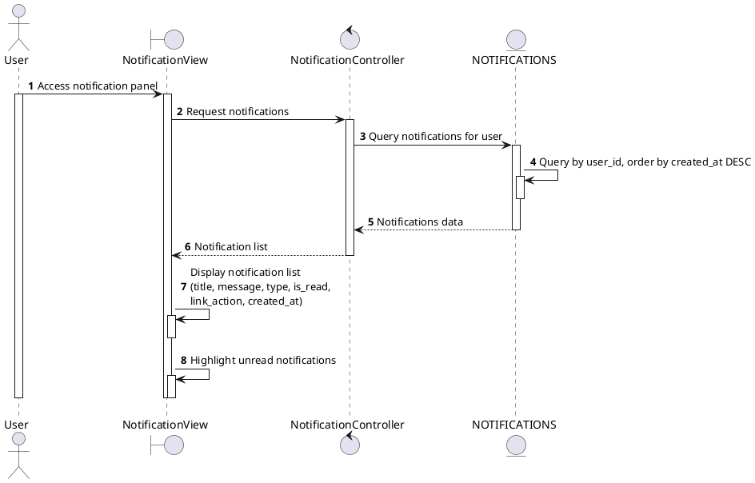

# Sequence Receive Notification

```plantuml
@startuml
autonumber

actor User as U
boundary NotificationView as NV
control NotificationController as NC
entity NOTIFICATIONS as N

U -> NV: Access notification panel
activate U
activate NV

NV -> NC: Request notifications
activate NC

NC -> N: Query notifications for user
activate N
N -> N: Query by user_id, order by created_at DESC
activate N
deactivate N
NC <-- N: Notifications data
deactivate N

NV <-- NC: Notification list
deactivate NC

NV -> NV: Display notification list\n(title, message, type, is_read,\nlink_action, created_at)
activate NV
deactivate NV

NV -> NV: Highlight unread notifications
activate NV
deactivate NV

deactivate NV
deactivate U

@enduml
```

<!-- diagram id="sequence-notification-management-receive-notification" -->
