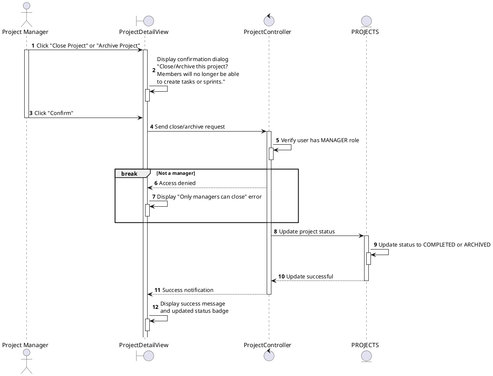

# Sequence Close / Archive Project

```plantuml
@startuml
autonumber

actor "Project Manager" as PM
boundary ProjectDetailView as PDV
control ProjectController as PC
entity PROJECTS as P

PM -> PDV: Click "Close Project" or "Archive Project"
activate PM
activate PDV
PDV -> PDV: Display confirmation dialog\n"Close/Archive this project?\nMembers will no longer be able\nto create tasks or sprints."
activate PDV
deactivate PDV

PM -> PDV: Click "Confirm"
deactivate PM

PDV -> PC: Send close/archive request
activate PC
PC -> PC: Verify user has MANAGER role
activate PC
deactivate PC

break Not a manager
  PDV <-- PC: Access denied
  PDV -> PDV: Display "Only managers can close" error
  activate PDV
  deactivate PDV
end

PC -> P: Update project status
activate P
P -> P: Update status to COMPLETED or ARCHIVED
activate P
deactivate P
PC <-- P: Update successful
deactivate P

PDV <-- PC: Success notification
deactivate PC
PDV -> PDV: Display success message\nand updated status badge
activate PDV
deactivate PDV

@enduml
```

<!-- diagram id="sequence-project-management-close-archive-project" -->
