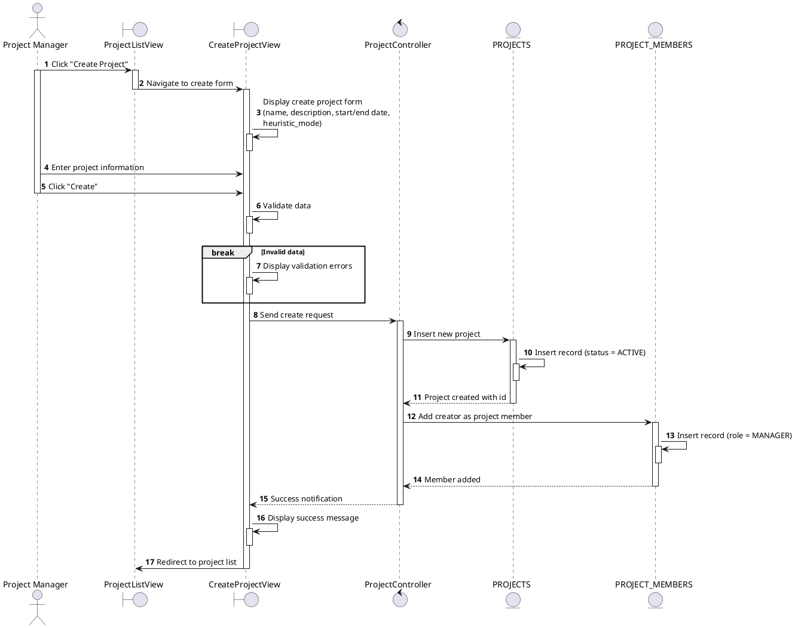

# Sequence Create New Project

```plantuml
@startuml
autonumber

actor "Project Manager" as PM
boundary ProjectListView as PLV
boundary CreateProjectView as CPV
control ProjectController as PC
entity PROJECTS as P
entity PROJECT_MEMBERS as PME

PM -> PLV: Click "Create Project"
activate PM
activate PLV
PLV -> CPV: Navigate to create form
deactivate PLV
activate CPV
CPV -> CPV: Display create project form\n(name, description, start/end date,\nheuristic_mode)
activate CPV
deactivate CPV

PM -> CPV: Enter project information
PM -> CPV: Click "Create"
deactivate PM
CPV -> CPV: Validate data
activate CPV
deactivate CPV

break Invalid data
  CPV -> CPV: Display validation errors
  activate CPV
  deactivate CPV
end

CPV -> PC: Send create request
activate PC
PC -> P: Insert new project
activate P
P -> P: Insert record (status = ACTIVE)
activate P
deactivate P
PC <-- P: Project created with id
deactivate P

PC -> PME: Add creator as project member
activate PME
PME -> PME: Insert record (role = MANAGER)
activate PME
deactivate PME
PC <-- PME: Member added
deactivate PME

CPV <-- PC: Success notification
deactivate PC
CPV -> CPV: Display success message
activate CPV
deactivate CPV
CPV -> PLV: Redirect to project list
deactivate CPV

@enduml
```

<!-- diagram id="sequence-project-management-create-new-project" -->
