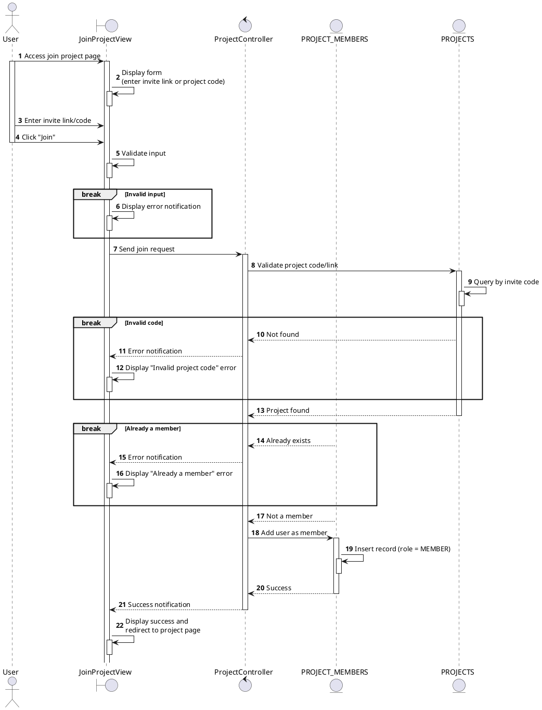

# Sequence Join Project

```plantuml
@startuml
autonumber

actor User as U
boundary JoinProjectView as JPV
control ProjectController as PC
entity PROJECT_MEMBERS as PM
entity PROJECTS as P

U -> JPV: Access join project page
activate U
activate JPV
JPV -> JPV: Display form\n(enter invite link or project code)
activate JPV
deactivate JPV

U -> JPV: Enter invite link/code
U -> JPV: Click "Join"
deactivate U
JPV -> JPV: Validate input
activate JPV
deactivate JPV

break Invalid input
  JPV -> JPV: Display error notification
  activate JPV
  deactivate JPV
end

JPV -> PC: Send join request
activate PC
PC -> P: Validate project code/link
activate P
P -> P: Query by invite code
activate P
deactivate P

break Invalid code
  PC <-- P: Not found
  JPV <-- PC: Error notification
  JPV -> JPV: Display "Invalid project code" error
  activate JPV
  deactivate JPV
end

PC <-- P: Project found
deactivate P

break Already a member
  PC <-- PM: Already exists
  JPV <-- PC: Error notification
  JPV -> JPV: Display "Already a member" error
  activate JPV
  deactivate JPV
end

PC <-- PM: Not a member
deactivate PM

PC -> PM: Add user as member
activate PM
PM -> PM: Insert record (role = MEMBER)
activate PM
deactivate PM
PC <-- PM: Success
deactivate PM

JPV <-- PC: Success notification
deactivate PC
JPV -> JPV: Display success and\nredirect to project page
activate JPV
deactivate JPV

@enduml
```

<!-- diagram id="sequence-project-management-join-project" -->
