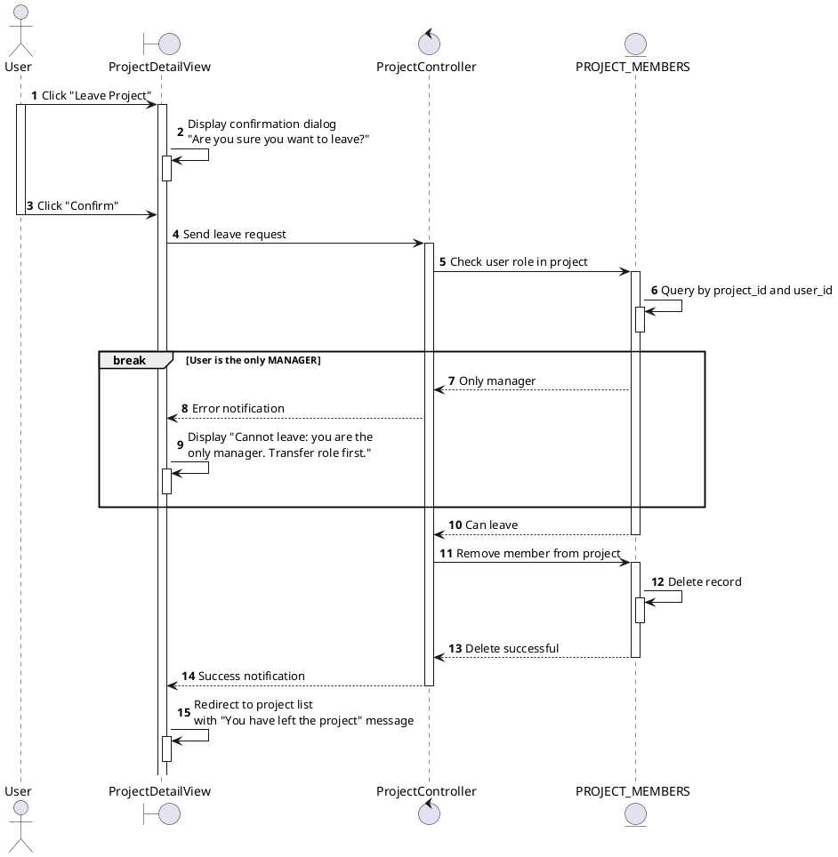

# Sequence Leave Project

```plantuml
@startuml
autonumber

actor User as U
boundary ProjectDetailView as PDV
control ProjectController as PC
entity PROJECT_MEMBERS as PM

U -> PDV: Click "Leave Project"
activate U
activate PDV
PDV -> PDV: Display confirmation dialog\n"Are you sure you want to leave?"
activate PDV
deactivate PDV

U -> PDV: Click "Confirm"
deactivate U

PDV -> PC: Send leave request
activate PC

PC -> PM: Check user role in project
activate PM
PM -> PM: Query by project_id and user_id
activate PM
deactivate PM

break User is the only MANAGER
  PC <-- PM: Only manager
  PDV <-- PC: Error notification
  PDV -> PDV: Display "Cannot leave: you are the\nonly manager. Transfer role first."
  activate PDV
  deactivate PDV
end

PC <-- PM: Can leave
deactivate PM

PC -> PM: Remove member from project
activate PM
PM -> PM: Delete record
activate PM
deactivate PM
PC <-- PM: Delete successful
deactivate PM

PDV <-- PC: Success notification
deactivate PC
PDV -> PDV: Redirect to project list\nwith "You have left the project" message
activate PDV
deactivate PDV

@enduml
```

<!-- diagram id="sequence-project-management-leave-project" -->
