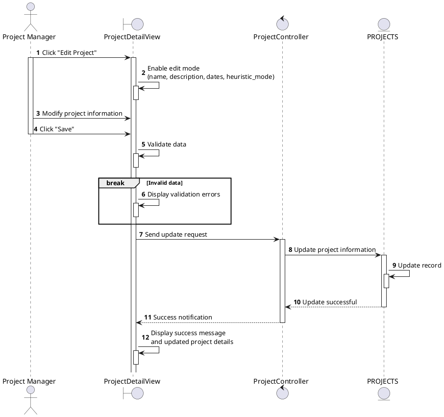

# Sequence Update Project Information

```plantuml
@startuml
autonumber

actor "Project Manager" as PM
boundary ProjectDetailView as PDV
control ProjectController as PC
entity PROJECTS as P

PM -> PDV: Click "Edit Project"
activate PM
activate PDV
PDV -> PDV: Enable edit mode\n(name, description, dates, heuristic_mode)
activate PDV
deactivate PDV

PM -> PDV: Modify project information
PM -> PDV: Click "Save"
deactivate PM
PDV -> PDV: Validate data
activate PDV
deactivate PDV

break Invalid data
  PDV -> PDV: Display validation errors
  activate PDV
  deactivate PDV
end

PDV -> PC: Send update request
activate PC

PC -> P: Update project information
activate P
P -> P: Update record
activate P
deactivate P
PC <-- P: Update successful
deactivate P

PDV <-- PC: Success notification
deactivate PC
PDV -> PDV: Display success message\nand updated project details
activate PDV
deactivate PDV

@enduml
```

<!-- diagram id="sequence-project-management-update-project-information" -->
