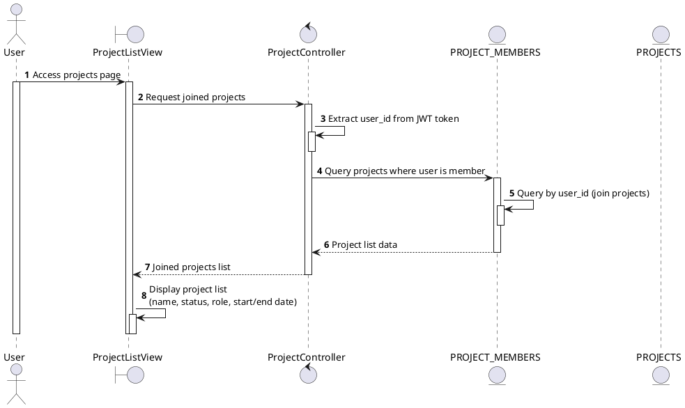

# Sequence View Joined Projects

```plantuml
@startuml
autonumber

actor User as U
boundary ProjectListView as PLV
control ProjectController as PC
entity PROJECT_MEMBERS as PM
entity PROJECTS as P

U -> PLV: Access projects page
activate U
activate PLV
PLV -> PC: Request joined projects
activate PC
PC -> PC: Extract user_id from JWT token
activate PC
deactivate PC
PC -> PM: Query projects where user is member
activate PM
PM -> PM: Query by user_id (join projects)
activate PM
deactivate PM
PC <-- PM: Project list data
deactivate PM
PLV <-- PC: Joined projects list
deactivate PC
PLV -> PLV: Display project list\n(name, status, role, start/end date)
activate PLV
deactivate PLV
deactivate PLV
deactivate U

@enduml
```

<!-- diagram id="sequence-project-management-view-joined-projects" -->
