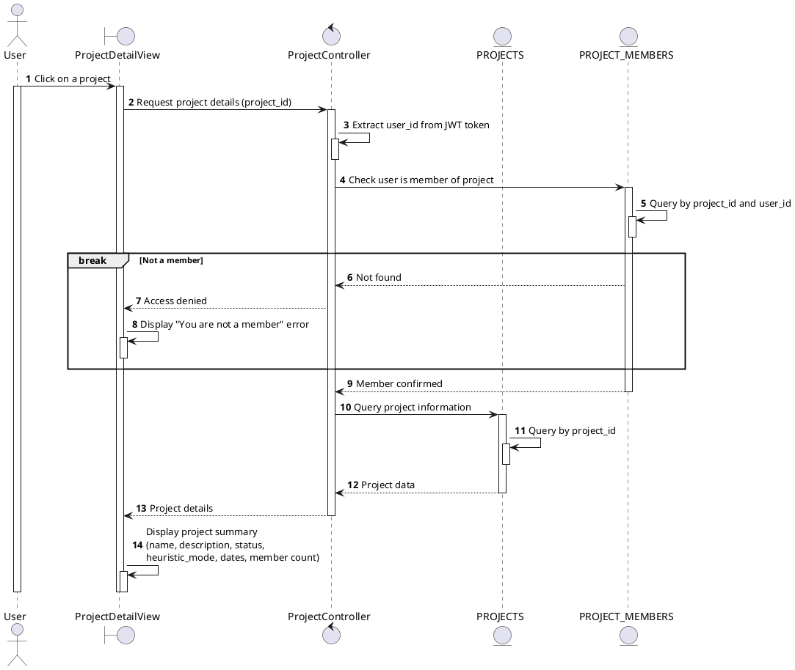

# Sequence View Project Details

```plantuml
@startuml
autonumber

actor User as U
boundary ProjectDetailView as PDV
control ProjectController as PC
entity PROJECTS as P
entity PROJECT_MEMBERS as PM

U -> PDV: Click on a project
activate U
activate PDV
PDV -> PC: Request project details (project_id)
activate PC
PC -> PC: Extract user_id from JWT token
activate PC
deactivate PC

PC -> PM: Check user is member of project
activate PM
PM -> PM: Query by project_id and user_id
activate PM
deactivate PM

break Not a member
  PC <-- PM: Not found
  PDV <-- PC: Access denied
  PDV -> PDV: Display "You are not a member" error
  activate PDV
  deactivate PDV
end

PC <-- PM: Member confirmed
deactivate PM

PC -> P: Query project information
activate P
P -> P: Query by project_id
activate P
deactivate P
PC <-- P: Project data
deactivate P

PDV <-- PC: Project details
deactivate PC
PDV -> PDV: Display project summary\n(name, description, status,\nheuristic_mode, dates, member count)
activate PDV
deactivate PDV
deactivate PDV
deactivate U

@enduml
```

<!-- diagram id="sequence-project-management-view-project-details" -->
