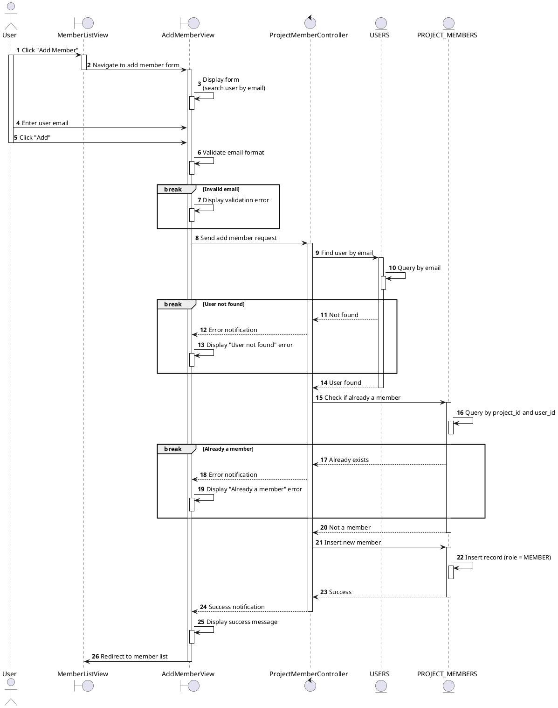

# Sequence Add Member to Project

```plantuml
@startuml
autonumber

actor User as U
boundary MemberListView as MLV
boundary AddMemberView as AMV
control ProjectMemberController as PMC
entity USERS as US
entity PROJECT_MEMBERS as PM

U -> MLV: Click "Add Member"
activate U
activate MLV
MLV -> AMV: Navigate to add member form
deactivate MLV
activate AMV
AMV -> AMV: Display form\n(search user by email)
activate AMV
deactivate AMV

U -> AMV: Enter user email
U -> AMV: Click "Add"
deactivate U
AMV -> AMV: Validate email format
activate AMV
deactivate AMV

break Invalid email
  AMV -> AMV: Display validation error
  activate AMV
  deactivate AMV
end

AMV -> PMC: Send add member request
activate PMC
PMC -> US: Find user by email
activate US
US -> US: Query by email
activate US
deactivate US

break User not found
  PMC <-- US: Not found
  AMV <-- PMC: Error notification
  AMV -> AMV: Display "User not found" error
  activate AMV
  deactivate AMV
end

PMC <-- US: User found
deactivate US

PMC -> PM: Check if already a member
activate PM
PM -> PM: Query by project_id and user_id
activate PM
deactivate PM

break Already a member
  PMC <-- PM: Already exists
  AMV <-- PMC: Error notification
  AMV -> AMV: Display "Already a member" error
  activate AMV
  deactivate AMV
end

PMC <-- PM: Not a member
deactivate PM

PMC -> PM: Insert new member
activate PM
PM -> PM: Insert record (role = MEMBER)
activate PM
deactivate PM
PMC <-- PM: Success
deactivate PM

AMV <-- PMC: Success notification
deactivate PMC
AMV -> AMV: Display success message
activate AMV
deactivate AMV
AMV -> MLV: Redirect to member list
deactivate AMV

@enduml
```

<!-- diagram id="sequence-project-members-add-member-to-project" -->
