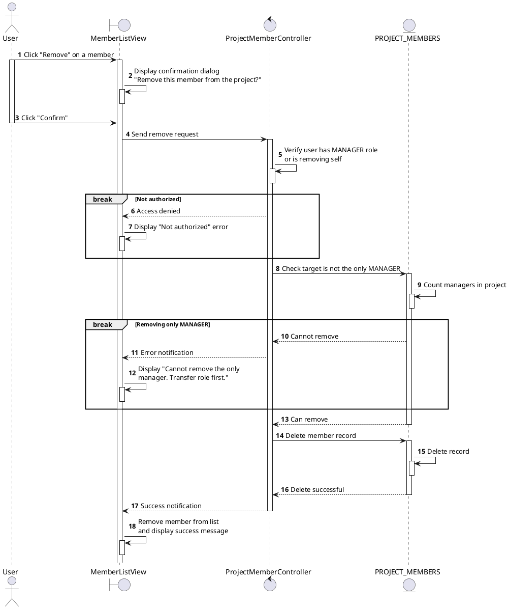

# Sequence Remove Member from Project

```plantuml
@startuml
autonumber

actor User as U
boundary MemberListView as MLV
control ProjectMemberController as PMC
entity PROJECT_MEMBERS as PM

U -> MLV: Click "Remove" on a member
activate U
activate MLV
MLV -> MLV: Display confirmation dialog\n"Remove this member from the project?"
activate MLV
deactivate MLV

U -> MLV: Click "Confirm"
deactivate U

MLV -> PMC: Send remove request
activate PMC
PMC -> PMC: Verify user has MANAGER role\nor is removing self
activate PMC
deactivate PMC

break Not authorized
  MLV <-- PMC: Access denied
  MLV -> MLV: Display "Not authorized" error
  activate MLV
  deactivate MLV
end

PMC -> PM: Check target is not the only MANAGER
activate PM
PM -> PM: Count managers in project
activate PM
deactivate PM

break Removing only MANAGER
  PMC <-- PM: Cannot remove
  MLV <-- PMC: Error notification
  MLV -> MLV: Display "Cannot remove the only\nmanager. Transfer role first."
  activate MLV
  deactivate MLV
end

PMC <-- PM: Can remove
deactivate PM

PMC -> PM: Delete member record
activate PM
PM -> PM: Delete record
activate PM
deactivate PM
PMC <-- PM: Delete successful
deactivate PM

MLV <-- PMC: Success notification
deactivate PMC
MLV -> MLV: Remove member from list\nand display success message
activate MLV
deactivate MLV

@enduml
```

<!-- diagram id="sequence-project-members-remove-member-from-project" -->
