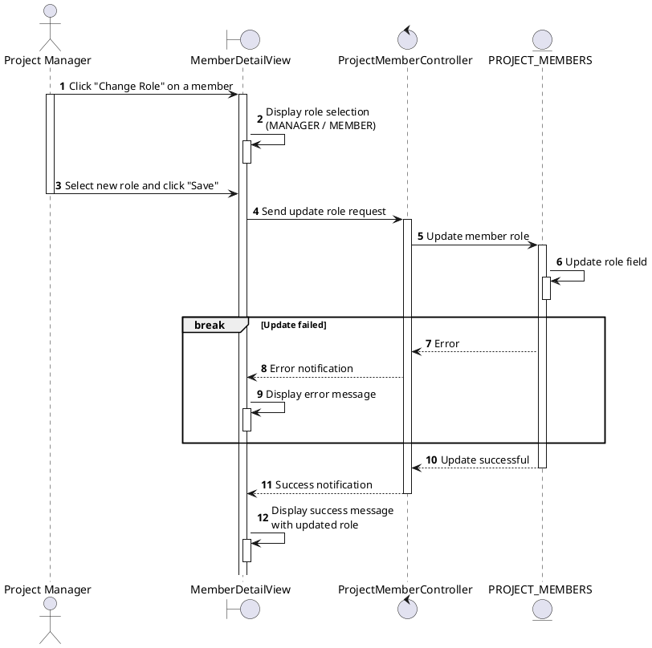

# Sequence Update Member Role

```plantuml
@startuml
autonumber

actor "Project Manager" as PMR
boundary MemberDetailView as MDV
control ProjectMemberController as PMC
entity PROJECT_MEMBERS as PM

PMR -> MDV: Click "Change Role" on a member
activate PMR
activate MDV
MDV -> MDV: Display role selection\n(MANAGER / MEMBER)
activate MDV
deactivate MDV

PMR -> MDV: Select new role and click "Save"
deactivate PMR

MDV -> PMC: Send update role request
activate PMC

PMC -> PM: Update member role
activate PM
PM -> PM: Update role field
activate PM
deactivate PM

break Update failed
  PMC <-- PM: Error
  MDV <-- PMC: Error notification
  MDV -> MDV: Display error message
  activate MDV
  deactivate MDV
end

PMC <-- PM: Update successful
deactivate PM

MDV <-- PMC: Success notification
deactivate PMC
MDV -> MDV: Display success message\nwith updated role
activate MDV
deactivate MDV

@enduml
```

<!-- diagram id="sequence-project-members-update-member-role" -->
