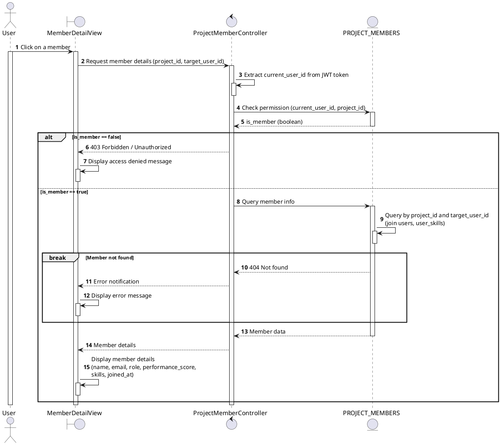

# Sequence View Member Details

```plantuml
@startuml
autonumber

actor User as U
boundary MemberDetailView as MDV
control ProjectMemberController as PMC
entity PROJECT_MEMBERS as PM

U -> MDV: Click on a member
activate U
activate MDV

MDV -> PMC: Request member details (project_id, target_user_id)
activate PMC

PMC -> PMC: Extract current_user_id from JWT token
activate PMC
deactivate PMC

PMC -> PM: Check permission (current_user_id, project_id)
activate PM
PMC <-- PM: is_member (boolean)
deactivate PM

alt is_member == false
    MDV <-- PMC: 403 Forbidden / Unauthorized
    MDV -> MDV: Display access denied message
    activate MDV
    deactivate MDV
else is_member == true
    PMC -> PM: Query member info
    activate PM
    PM -> PM: Query by project_id and target_user_id\n(join users, user_skills)
    activate PM
    deactivate PM

    break Member not found
        PMC <-- PM: 404 Not found
        MDV <-- PMC: Error notification
        MDV -> MDV: Display error message
        activate MDV
        deactivate MDV
    end

    PMC <-- PM: Member data
    deactivate PM
    MDV <-- PMC: Member details
    
    MDV -> MDV: Display member details\n(name, email, role, performance_score,\nskills, joined_at)
    activate MDV
    deactivate MDV
end

deactivate PMC
deactivate MDV
deactivate U

@enduml

@enduml
```

<!-- diagram id="sequence-project-members-view-member-details" -->
