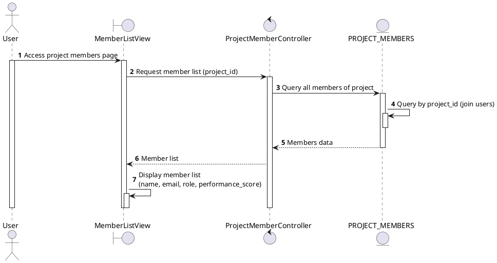

# Sequence View Project Member List

```plantuml
@startuml
autonumber

actor User as U
boundary MemberListView as MLV
control ProjectMemberController as PMC
entity PROJECT_MEMBERS as PM

U -> MLV: Access project members page
activate U
activate MLV

MLV -> PMC: Request member list (project_id)
activate PMC

PMC -> PM: Query all members of project
activate PM
PM -> PM: Query by project_id (join users)
activate PM
deactivate PM
PMC <-- PM: Members data
deactivate PM

MLV <-- PMC: Member list

MLV -> MLV: Display member list\n(name, email, role, performance_score)
activate MLV
deactivate MLV

deactivate PMC
deactivate MLV
deactivate U

@enduml
```

<!-- diagram id="sequence-project-members-view-project-member-list" -->
