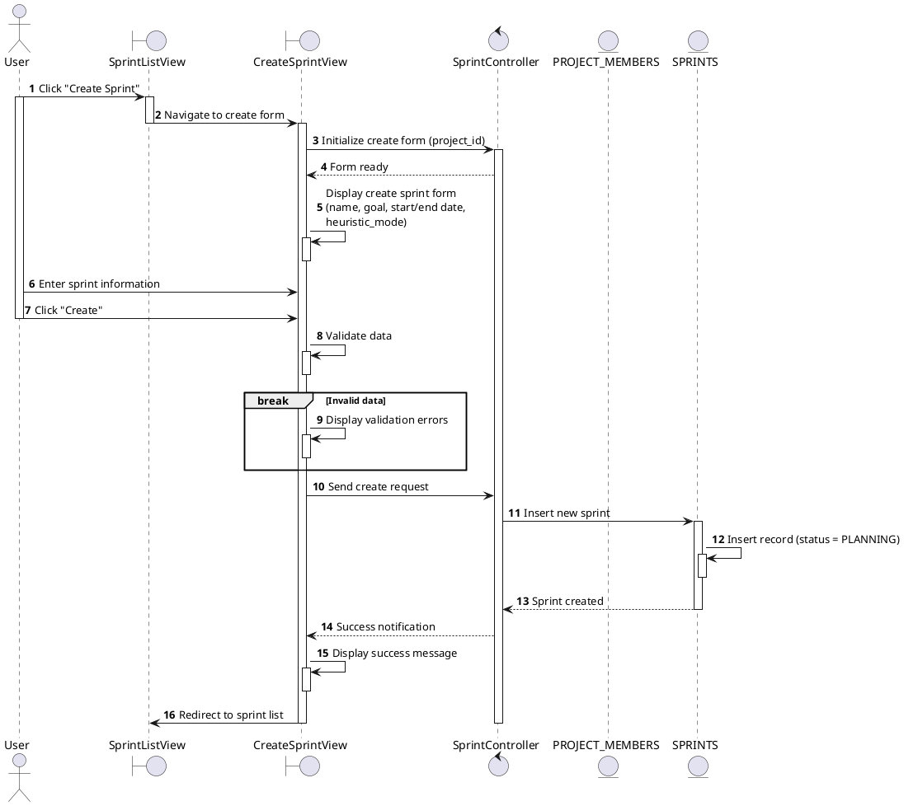

# Sequence Create New Sprint

```plantuml
@startuml
autonumber

actor User as U
boundary SprintListView as SLV
boundary CreateSprintView as CSV
control SprintController as SC
entity PROJECT_MEMBERS as PM
entity SPRINTS as SP

U -> SLV: Click "Create Sprint"
activate U
activate SLV

SLV -> CSV: Navigate to create form
deactivate SLV
activate CSV

CSV -> SC: Initialize create form (project_id)
activate SC

CSV <-- SC: Form ready

CSV -> CSV: Display create sprint form\n(name, goal, start/end date,\nheuristic_mode)
activate CSV
deactivate CSV

U -> CSV: Enter sprint information
U -> CSV: Click "Create"
deactivate U

CSV -> CSV: Validate data
activate CSV
deactivate CSV

break Invalid data
    CSV -> CSV: Display validation errors
    activate CSV
    deactivate CSV
end

CSV -> SC: Send create request

SC -> SP: Insert new sprint
activate SP
SP -> SP: Insert record (status = PLANNING)
activate SP
deactivate SP
SC <-- SP: Sprint created
deactivate SP

CSV <-- SC: Success notification

CSV -> CSV: Display success message
activate CSV
deactivate CSV
CSV -> SLV: Redirect to sprint list
deactivate CSV

deactivate SC

@enduml
```

<!-- diagram id="sequence-sprint-management-create-new-sprint" -->
