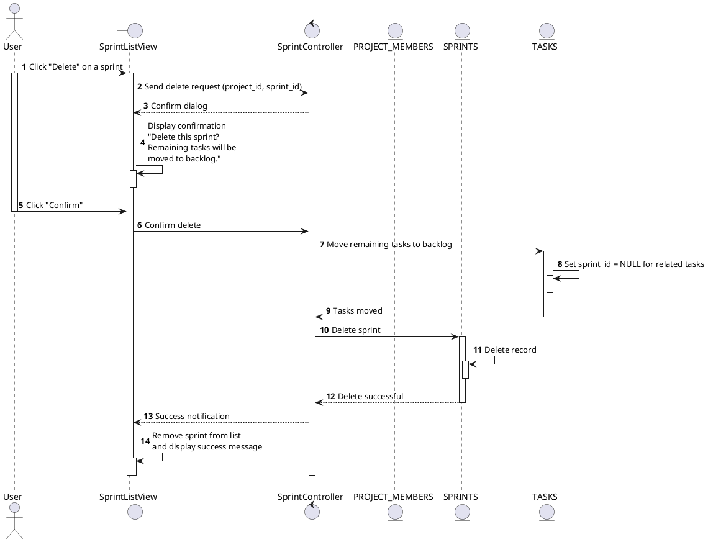

# Sequence Delete Sprint

```plantuml
@startuml
autonumber

actor User as U
boundary SprintListView as SLV
control SprintController as SC
entity PROJECT_MEMBERS as PM
entity SPRINTS as SP
entity TASKS as T

U -> SLV: Click "Delete" on a sprint
activate U
activate SLV

SLV -> SC: Send delete request (project_id, sprint_id)
activate SC

SLV <-- SC: Confirm dialog

SLV -> SLV: Display confirmation\n"Delete this sprint?\nRemaining tasks will be\nmoved to backlog."
activate SLV
deactivate SLV

U -> SLV: Click "Confirm"
deactivate U

SLV -> SC: Confirm delete

SC -> T: Move remaining tasks to backlog
activate T
T -> T: Set sprint_id = NULL for related tasks
activate T
deactivate T
SC <-- T: Tasks moved
deactivate T

SC -> SP: Delete sprint
activate SP
SP -> SP: Delete record
activate SP
deactivate SP
SC <-- SP: Delete successful
deactivate SP

SLV <-- SC: Success notification

SLV -> SLV: Remove sprint from list\nand display success message
activate SLV
deactivate SLV

deactivate SC
deactivate SLV

@enduml
```

<!-- diagram id="sequence-sprint-management-delete-sprint" -->
