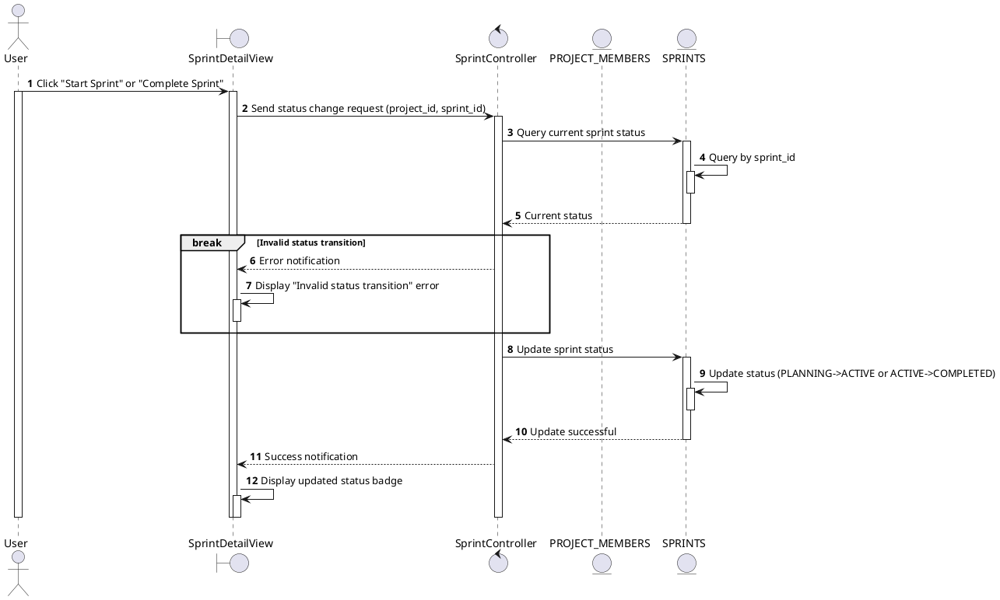

# Sequence Start / Complete Sprint

```plantuml
@startuml
autonumber

actor User as U
boundary SprintDetailView as SDV
control SprintController as SC
entity PROJECT_MEMBERS as PM
entity SPRINTS as SP

U -> SDV: Click "Start Sprint" or "Complete Sprint"
activate U
activate SDV

SDV -> SC: Send status change request (project_id, sprint_id)
activate SC

SC -> SP: Query current sprint status
activate SP
SP -> SP: Query by sprint_id
activate SP
deactivate SP
SC <-- SP: Current status
deactivate SP

break Invalid status transition
    SDV <-- SC: Error notification
    SDV -> SDV: Display "Invalid status transition" error
    activate SDV
    deactivate SDV
end

SC -> SP: Update sprint status
activate SP
SP -> SP: Update status (PLANNING->ACTIVE or ACTIVE->COMPLETED)
activate SP
deactivate SP
SC <-- SP: Update successful
deactivate SP

SDV <-- SC: Success notification

SDV -> SDV: Display updated status badge
activate SDV
deactivate SDV

deactivate SC
deactivate SDV
deactivate U

@enduml
```

<!-- diagram id="sequence-sprint-management-start-complete-sprint" -->
